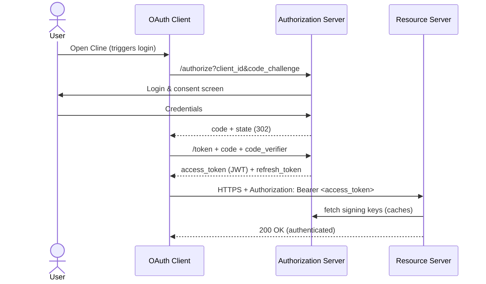

# OAuthがどう動くかを理解する

そもそも、OAuthがどう動くかを理解するために検証を行います。  
今回、Auth0 + ALBで認証を試しました。  

## OAuthについて学ぶ

まずはOAuthを理解します。  
以下はいくつか書いてますが、正直参考サイトをそのまま書いているレベルです。(自分の理解のために抽出して書いただけ)  
なので、ちゃんと理解したい人は以下の参考サイトをみましょう。個人メモ的に私のメモも残しますが。  

[参考サイト]

- https://qiita.com/TakahikoKawasaki/items/200951e5b5929f840a1f
- https://zenn.dev/edash_tech_blog/articles/5c82b868c7a781

### OAuthのプロトコルフロー

以下の想定で記載します。  
- OAuthClient: cline
- Authorization Server: IAM Identity Center
- ReourceServer: MCP Server



以下のサイトが非常にわかりやすいです。  
https://qiita.com/TakahikoKawasaki/items/200951e5b5929f840a1f


以下の図がわかりやすい。  
- **OAuth 2.0 認可 flow**  

  


認可サーバについて。  
認可サーバは複数の役割があり、 ロールによってアクセス先(APIエンドポイント)が異なる。  

1. 認可エンドポイント: clientからの認可リクエストを受け付ける
2. トークンエンドポイント: アクセストークンの払い出しを行う
3. イントロスペクションエンドポイント: リソースサーバ(認可を受ける側)でのアクセストークン情報を取得


認可エンドポイントには、関連して認可決定エンドポイントがある。  

認可リクエストでは以下のようなリクエストを受け付けている。  

```
GET {認可エンドポイント}
  ?response_type=code            // 必須
  &client_id={クライアントID}      // 必須
  &redirect_uri={リダイレクトURI}  // 条件により必須
  &scope={スコープ群}              // 任意
  &state={任意文字列}              // 推奨
  &code_challenge={チャレンジ}     // 任意
  &code_challege_method={メソッド} // 任意
  HTTP/1.1
HOST: {認可サーバー}
```

認可サーバは以下を返す。  

```
HTTP/1.1 302 Found
Location: {リダイレクトURI}
  ?code={認可コード}        // 必須
  &state={任意文字列}       // 認可リクエストに state が含まれていれば必須
```

トークンエンドポイントのレスポンス

```
HTTP/1.1 200 OK
Content-Type: application/json;charset=UTF-8
Cache-Control: no-store
Pragma: no-cache

{
  "access_token":"{アクセストークン}",       // 必須
  "token_type":"{トークンタイプ}",           // 必須
  "expires_in":{有効秒数},                  // 任意
  "refresh_token":"{リフレッシュトークン}",   // 任意
  "scope":"{スコープ群}"                    // 要求したスコープ群と差異があれば必須
}
```

- **OAuth 2.0 implicit flow**  

トークンエンドポイントからのトークン取得が個別リクエストとして送らなくてもいいフロー。  
認可エンドポイントからのレスポンスに最終的にアクセストークンが渡されている。  


implicit flowではリフレッシュトークンは発行されない。  

- **OAuth 2.0 Resource Owner Password Credentials Grant**  

クライアントアプリがID・パスワードを受け取る形。  


前２つは認可の画面を受け取って、そこで認証させる形(クライアントアプリはこの認証フローを直接処理しない)だった。  
この場合は、リクエストにもユーザ名とパスワードを渡してリクエストする方式になる.  

```
POST {トークンエンドポイント} HTTP/1.1
Host: {認可サーバー}
Content-Type: application/x-www-form-urlencoded

grant_type=password     // 必須
&username={ユーザーID}    // 必須
&password={パスワード}    // 必須
&scope={スコープ群}       // 任意
```

- **OAuth 2.0 Client Credentials Grant**  

ユーザーの認証は行わず、トークンベースでのアプリ認証のみが行われる。  
（事前発行のトークンが使われる)  


- **OAuth 2.0 Refresh Token Flow**  

事前に発行されているリフレッシュトークンを使う方法。


## OAuthを試す

OAuthの場合、どうやらIAM Identity CenterはIdPになれないようですので(間違ってたらごめんなさい)、別を使ってみます。  
まず、Auth0でやってみました。  

これは以下を見るとわかりやすいです。  
https://zenn.dev/edash_tech_blog/articles/5c82b868c7a781

なお、いくつか重要な点を補足します。  
1. IssuerURLの末尾のスラッシュは必須
2. ALBのセキュリティグループで、HTTPSの外部アクセスを許可してください。(トークンの検証用だと思われます)

この２つはどっちも間違えると401 Authorizationエラーになりました。  

## 終わり

OAuthについてはざっくり理解できたいので、このドキュメント自体はこれで終わりです。
