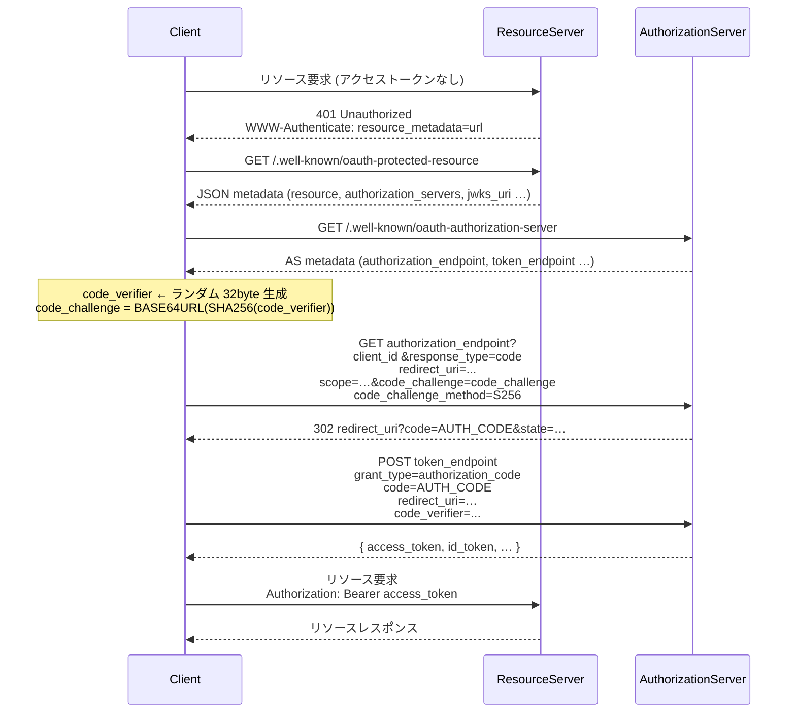

# MCPでのOAuthを試したい

OAuthでの認証・認可をMCP Server間で行いたいと思います。  

## MCPサーバは開発環境では一旦HTTPにする

まず、OAuthの認証を行うとしても、ローカル開発環境ではHTTPにします。  
理由は、簡単にHTTPSにできないからです(わからないとも言います)。  
python sdkを使う際に証明書情報などを渡すやり方が少なくともmcp.runで起動する際になく(これはfunctionの引数になかった)、さらにuvicornを別途動かすとしてもその際にsseモードで動かす方法が分からなかったからです。  

本番環境はALBなどによるHTTPSを介するとして、ローカルはHTTPでやってみます。  

## MCPにおけるOAuth

まず、以下が公式のドキュメントです。  
https://modelcontextprotocol.io/specification/2025-06-18/basic/authorization

これと、以下の公式サンプルMCPサーバを見てみましょう。  
[python-sdk/examples/servers/simple-auth/mcp_simple_auth/server.py](https://github.com/modelcontextprotocol/python-sdk/blob/main/examples/servers/simple-auth/mcp_simple_auth/server.py)

まず、MCPサーバはRFC 9728を使われます。あわせて、認可コードの横取り対策のためにchallengeを使った検証(PKCE)の組み込みが必須です。  
https://modelcontextprotocol.io/specification/2025-06-18/basic/authorization

## python-sdkにあるauthentication用のClientを試す

この件、いろいろ試そうとしていましたがClineとかで動かすことができず、よくわからない。。となりました。  
そのため、python-sdkにある以下のサンプル用Clientを試してみたいと思います。  
ちなみに、この際にサーバも上記したサンプルのAuth Serverを利用しています。  

- Client: https://github.com/modelcontextprotocol/python-sdk/tree/main/examples/clients/simple-auth-client
- Server: https://github.com/modelcontextprotocol/python-sdk/blob/main/examples/servers/simple-auth

これで試すと、サーバ側で確かにauthentication(らしき動き)が発生していることがわかります。  

ちなみにまともに動くものではないので、あくまでサンプル用ですね。  

これを見ると、ちゃんと401が返され、その後にauthorizationサーバへの情報をmetadataから取得するようになっていますね。  

## 個人的な感想

私はMCP Serverにauthenticationをつける場合は、今の所ALBでやろうかな、と思っています。  
どっちにしてもMCP Serverを自前で建てる場合はAWSのECSを使うつもりですし。  
HTTPSにすることも含め、その方が楽でいいな、と感じています。  
