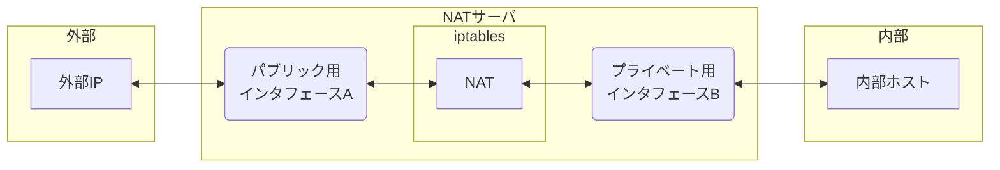
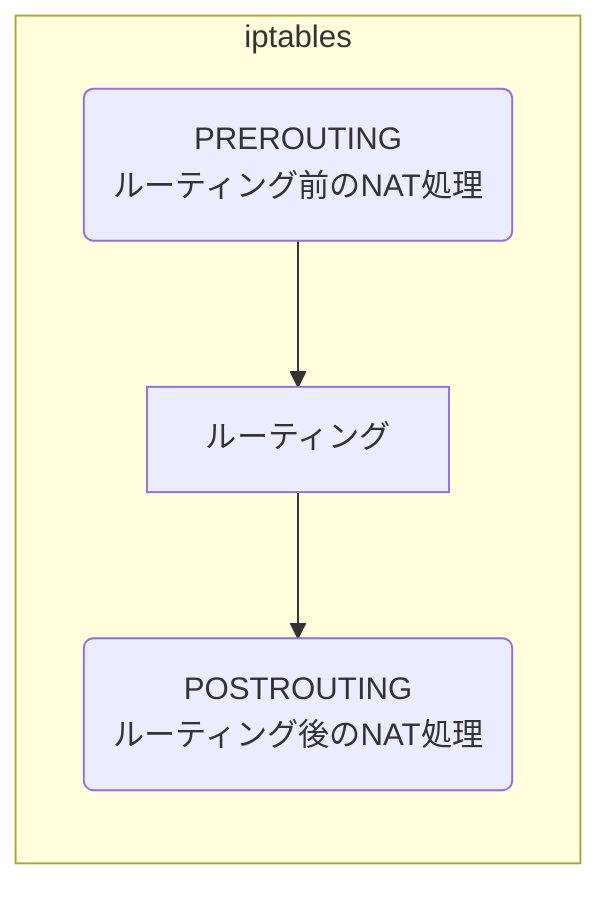

# AWSで基本的なネットワーク構成をしてみる

前回、AWS上でEKSなどの説明をしようとしましたが、そのためにまずはAWS上で基本的な構成をやってみます。  
その後、CloudFormationやらを試す前にまずは、この辺りをやってみます。  

### やりたいこと

AWSで、パブリックネットワークとプライベートネットワークを作成。  
プライベートネットワークに置いたサーバはパブリックに置いたファイアウォール（またはNAT用ホスト）を利用して外部通信。  
また、メンテナンス用の踏み台ホストを1台準備する。  


すごくざっくりした内容ですが、こんな感じです。  
ネットワークアクセスについては、パブリックに処理するインスタンスがいればELB（ALB）を利用することもできます。  
NATホストを説明後、それについて少しご説明をします。  

AWSでは、ネットワークを構成する上で以下のようなものを作っていきます。  

1. VPC  
   自分のネットワーク環境みたいなものです。基本的にVPC間は通信できません
2. サブネット  
   VPCはグルーピングのようなものでしかないので、基本的になかにサブネットが必要です。（VPC作成時点でデフォルトサブネットはできますが）。このサブネットは一般的なネットワークにおけるサブネットとほぼ同義です。
3. IGW(インターネットゲートウェイ)  
   VPC内の各種ホストが通信できるようにするための出入口になります。また、EIPなどEC2に割り当てたグローバルIPを各ホストのプライベートIPに静的NATを行います。重要なのはNAT設定などはできず、またこれ自体がインターフェース（及びIP）を持たないということです。VPC内は必ずプライベートIPで処理するので、そのための処理だけする存在ですね。  

このネットワーク環境で、パブリックとプライベートのサブネットはIGWへのルートがあるかどうかだけが違いです。  
IGWへの通信ルートが定義されているなら、これは外部通信ができるのでパブリックサブネット、ということですね。  

この中で、以下を試していきたいと思います。  

1. NATゲートウェイ利用(※)  
2. NAT用ホスト(iptables)  
3. ELBの利用(の説明)
4. マーケットプレイスのFW  
5. AWS network firewall  
※この構成はできないけどアウトバウンドはできることを確認

1は構成しても使えないのですが、よくあるNAT機能のため、説明とデプロイだけやってみたいと思います。  
さて、それでは作成していきましょう。  

### ネットワークの作成(VPC+サブネット)

まずは、基礎となるVPCとサブネット及びIGWを作成していきましょう。  
とはいっても、これらはVPCを作成するときに一気に作れます。  


VPCの作成をクリックし、「VPC、サブネットなど」で作成します。


&dArr;


AZやサブネットの数（パブリック、プライベートでそれぞれ）を選択します。  
この時点でNATゲートウェイも併せて作成できます。その場合は、AZごとに1などを選びます。今回はAZは１つですので、まぁどっちでもいいですが。  


最後にVPCを作成をクリックすると作成が開始され、全て緑チェックになれば作成は完了です。  


さて、これで作成は完了しました。この後はこのVPCにインスタンスを配置していくことになります。
ただ、その前にプライベートサブネットとパブリックサブネットのルートだけ見ておきましょう。  

* プライベートサブネット


アウトバウンドのデフォルトルートとして、NATゲートウェイに向いてますね。  
Note: vpce-～というのはs3向けのものですので割愛  
これはサブネットをプライベートにして、NATゲートウェイ付きで作ると作成されるルートです。(※あとからNATゲートウェイを作った場合も同様のルートが必須です)  
しかし、IGWとの間のルートはありません。そのため、単純にIPを割り当てただけではプライベートサブネットは外部通信ができません。  
それに関連したのがNATゲートウェイですが、これは次項で説明しましょう。  


アウトバウンドのデフォルトルートとして、IGWに向いてますね。  
これはサブネットをパブリックで作成すると入るデフォルトルートです。これがついているということは、グローバルIPだけ割り当てれば、外部通信可能です。  

さて、これでVPC、IGW、サブネットの作成が完了しました。これで基盤は完了ですね。  

### NATゲートウェイ

前のVPC作成時に既に作っておりますので、どんなものかを見ていきましょう。  
サクッと画面を見てみたいと思います。  


まず、タブとして`詳細`、`モニタリング`、`タグ`だけです。細かい設定ができません。  
ということは、言ってみれば作れば終わり系のものです。これはいったい何なのかといいますと、通常のネットワークでいう動的NATというものを提供しています。  
一般に、FWとかにグローバルIPをいくつか割り当て、それを大量のホストで共有してますよね。  
こういう場合、ルータ(FW)がソースのIP・ポート番号を使ってセッションを管理することでIPが1つでも大量のホストがインターネットアクセスできる、という一般的な構成です。  

実際、これを構成してますので、プライベートサブネットのホストは外部通信が可能です。ただし、通常のホストと同じく、アウトバウンドだけになります。  
そのため、公開Webサーバをこの構成で構築することはできません。上でこれは使えないといったのはこの理由です。  

ただ、ついでなのでEC2のデプロイをして動作確認だけやってみましょう。  

### EC2のデプロイ

AWSで仮想ホスト(EC2)をデプロイするのはとても簡単です。  
EC2の画面を開き、インスタンスの起動から作成していきます。  


基本的に以下を選ぶ形です。  
* インスタンスイメージ(OSなど)  


* インスタンスタイプ(性能)


* デフォルトユーザでのログイン用SSHキー


* ネットワーク構成の設定  
  
Note: VPCやサブネットの選択

* セキュリティグループでの許可する通信の指定
  
Note: セキュリティグループでの制限であり、ここで許可してもサブネットのACLなどの制限がかかります。今回の場合、受信用のNAT設定をしてないため、実際には同VPC内のホストしか通信できません。  

* ストレージ設定
  

本番環境であれば、これ以外に終了時の削除保護やCloudWatchなどの監視設定もありますが、基本はこれぐらいです。  

これを利用して、以下のように踏み台サーバと内部のホストを1台作成します。  
#### 踏み台サーバ

|設定|内容|
|----|---|
|OSイメージ| AmazonLinux|
|タイプ| t2-micro|
|サブネット| パブリック|
|パブリックIPの自動割り当て| 有効|
|セキュリティグループ(IN)| ssh(任意の場所から)|
|セキュリティグループ(OUT)| フルオープン|

#### 内部ホスト

|設定|内容|
|----|----|
|OSイメージ| AmazonLinux|
|タイプ| t2-micro|
|サブネット| プライベート|
|パブリックIPの自動割り当て| 有効|
|セキュリティグループ(IN)| ssh,http(任意の場所から)|
|セキュリティグループ(OUT)| フルオープン|

これで構成が完了したら、踏み台サーバにSSHを実施してそこから内部ホストにSSHをします。  

踏み台サーバのグローバルIPはEC2の画面で確認できます。  


確認したら、作成時にダウンロードしたpemファイルでec2-userを利用してSSHしましょう。  
その後、内部ホストあてに再度SSHする形です。  


内部ホストから試しに`httpbin.org`あてにcurlをしてみますが、問題なくアクセスできています。  


これで、内部ホストは少なくとも外部通信できることが確認できました。ちなみにこの時のIPを確認しておきます。[確認くん](https://www.ugtop.com/spill.shtml)というサービスでチェックしてみましょうか。  


そうすると、`52.197.26.104`というIPになっています。このIPが何なのか設定を検索してみると、Elastic IPで定義したものであり、NATゲートウェイに割り当てられています。  


これで外部通信にはNATゲートウェイを利用していること、そしてNATゲートウェイではその他のNAT設定ができないため、受信用には利用できないことがわかりました。  
最後に、この環境は削除しておきます。  

### NATホストの利用

さて、ここからはちゃんと想定した構成が動作するためのものです。最初に挙げた以下図においてNATのところにNAT機能を持つインスタンスを利用します。  


何をやるのかといいますと、AmazonLinuxを1つ立てて、そのうえでiptablesを利用してNAT構成をします。  



EC2を立てることについては前回の説明とほぼ違いないですが、1つだけ異なることがあります。  
それは、ネットワークインタフェースを2つ作成し、それぞれ別セグメントに所属させていることです。  

これについては、ネットワークインタフェースの作成をする形になります。EC2の作成時にも行えます。  


または、作成後にインタフェースを追加するか、ですね。この辺りの細かいことは割愛します。  


作成が完了したら、パブリックサブネットに所属させているインターフェースのみEIP（グローバル）を関連付けます。  

これが完了したら、NATホストにsshでログインし、以下のようにiptablesの設定をしましょう。  
ちなみにこの時、TCP:80(HTTP)だけNATするようにしています。

```bash
# 宛先を内部ホストに変換
iptables -t nat -A PREROUTING -p tcp -d {NATサーバのパブリックインタフェースのIP} --dport 80 -j DNAT --to-destination {内部ホストのIP}:80

# ソースをNATサーバに変換
iptables -t nat -A POSTROUTING -p tcp -d {内部ホストのIP} --dport 80 -j SNAT --to-source {NATサーバのプライベートインタフェースのIP}
```

宛先を変換しているのはわかりやすいですが、ソースIPをNATサーバに変換しているのは戻りを制御するためです。  

iptablesでは以下のように2つのNATタイミングがあるため、PREROUTINGで宛先を変更、POSTROUTINGでソースを変えてます。  



改変後、以下のようにHTTPアクセスを確認したところ、問題なくアクセスできています。  


さて、これでNATサーバは完成です。ついでのメモ書きですが、iptablesでのテーブル確認やエントリ削除は以下の通りです。  

```bash
# テーブル確認
sudo iptables -t nat -L --line-numbers

# ルーティング前のNAT削除
iptables -t nat -D PREROUTING 1

# ルーティング後のNAT削除
iptables -t nat --delete POSTROUTING 1
```

### ELB(ALB)の利用

次は、ELB（Elastic Load Balancing）を使います。とても簡単にロードバランサが組めますし、SSLアクセラレータもできますし、動作していない場合のページも作れます。  
AWSでもとても使い勝手のいいサービスだと思います。  

構成イメージは以下のような形ですね。  
1つ注意が必要なのは、ALBを使う場合は2つ以上のAZ・サブネットで構成する必要があります。  


作成する際には、EC2（コンピューティング）のメニューを開き、ロードバランサで設定できます。  


作成すると以下のようにウィザードが開きます。  


今回はテストですので、基本的には以下のように設定すると動作します。  

- Basic Config
    * scheme: internet-facing
    * ip address type: IPv4
- Network mapping
    * VPC: テスト用のVPCを選択
    * mapping: 対象のサブネットを指定
- security group: デフォルトでOK
- Liseners and routing: ロードバランサが使うポートとマッピング先のホストを選択(上の画面ではマッピング先のグループは作ってません)
- Secure listener settings: 証明書を作成

やってみるとわかりますが、とても簡単ですので、是非お試しください。  
さて、ここまでお話ししてざっくりどういう風にやればAWS上でシステム構築できるか、その基礎はお判りいただけたかと思います。  

上にも書きましたが、これ以外にもマーケットプレイスにあるファイアウォール（Fortigateやpaloalto）を使うこともできますし、AWSの純正ファイアウォールを使うこともできます。  

よりセキュリティを万全に保つためにはこういった選択肢もありでしょう。  
