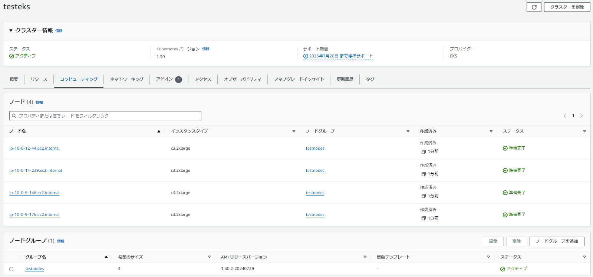

# EKSの利用について検証

仕事でkubernetes(k8s)上でthehiveを使うことがあり、ついでなのでAWSのEKS(elastic kubernetes service)で構築してみたいと思います。  
理由はただAWSでの構築ノウハウをつけたいからです。(EKS以外にamazon keyspaceやopensearchなどのサービスを使ったことないのでちょうどいい)

構築するもの: https://strangebee.com/thehive

## やりたいこと

thehiveは、内部でElasticSearch(opensearchもサポート)、CassandraDBを使っているため、これを以下の2パターンで構築します。
1. EKS オンリー
2. 個別に以下のサービスで構築
   - thehive : EKS
   - CassandraDB : Amazon keyspace
   - ElasticSearch : OpenSearch Service

冗長性なしのシンプル環境も含め、順を追って試していきたいと思います。  
あと、基本的にはCloudFormationはなし + GUIメインで作っていきます。

そのうえで、今回はまずEKSでシンプル構成で構築をします。  

### 準備

#### ツールの準備

以下は必須なのでインストールしてください。  
- aws cli
- kubectl
- eksctl
- helm

ちなみにk8sを操作するだけならkubectlですが、その他もAWSサービス操作に必要なため、使います。  

各種ツールをインストールしたら、以下を実施してください。  

1) AWS CLIのセットアップ

aws cliのインストールと認証情報のセットなどをしておいてください。ここは細かい話は省略します。  
ちなみに私はこれをAWSの管理者権限でやってしまっています。当然本番環境ではそうはいかないと思いますので、その辺りはIAMポリシーを見直してください。  

2) kubectl の接続

以下のコマンドでkubectlのための認証情報を取得し、kubeconfigにセットします。  

```ps
aws eks update-kubeconfig --region us-east-1 --name testeks
# output
# Updated context arn:aws:eks:us-east-1:{AWSAccount}:cluster/testeks in C:\Users\{username}\.kube\config
```

クラスタオーナー以外のユーザに権限を渡したいため、以下の様にIAMユーザに権限を渡します。  

```ps
eksctl create iamidentitymapping --cluster testeks --region us-east-1 --arn arn:aws:iam::{AWS_ACCOUNTID}:user/{IAM_USER_NAME} --group system:masters --username admin
```

以降はこのユーザ作業します。

#### 利用するdocker image

今回の構築では以下の3つのdocker imageを使います。全てdockerhubにあるものですね。CassandraDBだけはDocker Officialです。  
1. [strangebee/thehive:5.3.3-1](https://hub.docker.com/layers/strangebee/thehive/5.3.3-1/images/sha256-2aa4ffc416be4126206cba2545864d95344ee1fb526a7c957f1d642e7e6ebad3?context=explore)
2. [opensearchproject/opensearch:2.15.0](https://hub.docker.com/layers/opensearchproject/opensearch/2.15.0/images/sha256-63c91c1ee930cab4968609c6e85a3a3bd24c2d2559ed6e0d8d4c9df0d5d63798?context=explore)
3. [cassandra:4](https://hub.docker.com/layers/library/cassandra/4/images/sha256-34063dabad6d89b1a0824accd013af1958175b7809a2778f769061b27eedcf99?context=explore)

### Kubernetes clusterの作成

k8sクラスタ自体は別にこの後変えることはないので、まずはこれを作ります。  
なお、構成は以下です。
- region: us-east-1
- VPC: EKS用の専用VPCを作成(2 AZ)
- subnet: public subnet x 2(各AZで1つ)
- node: 各subnetに2つずつ

ちなみにこれは物理クラスタの話です。  
この上で、KubernetsはNode上に仮想のクラスタを展開します。これをNamespaceといい、このNamespace上でアプリを構築します。  

ということで、以下の通りNodeグループを作って4 nodeで起動させました。  
> 追記: お金が結構かかりそうだからNodeを2にしたりしてます。基本変わらないと思いますが。



最後に、namespaceを`thehive`で作成します。  

```ps
kubectl create namespace thehive
# namespace/thehive created
```


```ps
kubectl get namespace
NAME              STATUS   AGE
# 省略
thehive           Active   11s
```

最後に、今後の操作用にcontextにnamespaceを設定します。  
```ps
kubectl config set-context arn:aws:eks:us-east-1:111111111:cluster/testeks --namespace=thehive
# Context "arn:aws:eks:us-east-1:111111111:cluster/testeks" modified.
```

使用中のcontextにnamespaceがセットされていることを確認します。
```ps
kubectl config get-contexts
CURRENT NAME CLUSTER AUTHINFO NAMESPACE
*         arn:aws:eks:us-east-1:111111:cluster/testeks   arn:aws:eks:us-east-1:111111:cluster/testeks   arn:aws:eks:us-east-1:111111:cluster/testeks   thehive
```

### 永続ボリュームの準備

thehive、OpenScarch、CassandraDBのすべてが永続ボリュームが必要です。  
以下のサイトを参考に永続ボリューム「PersitenseVolume」の作成をしました。  
- https://blog.linkode.co.jp/entry/2020/07/01/142155#1-%E3%82%B9%E3%83%88%E3%83%AC%E3%83%BC%E3%82%B8%E3%82%AF%E3%83%A9%E3%82%B9%E3%81%AE%E4%BD%9C%E6%88%90

ざっくり流れを言います。  

- StorageClassの作成

今回は、thehive-volumeという名称で作成しました。  
これは、[storageClass.yaml](./deploy/storageClass.yaml)を使ってdeployしました。  

- IAMロールの作成

永続ボリュームはEBSで作成しており、ノードがこのEBSボリュームへアクセスできるようにするためのIAM設定をします。  
ポリシーの内容は、[Amazon_EBS_CSI_Driver.json](./config/Amazon_EBS_CSI_Driver.json)に保存されています。これをポリシーとして保存し、Nodeグループ作成時に指定したIAMロールに追加します。

- EBS CSIドライバのインストール

最後に以下のコマンドを実行してドライバのインストールをします。  
```ps
kubectl apply -k "github.com/kubernetes-sigs/aws-ebs-csi-driver/deploy/kubernetes/overlays/stable/?ref=master"
```

この後、PersistenseVolumeClaimを使ってボリューム作成をすれば完了です。  
これは、[pvClaim.yaml](./deploy/pvClaim.yaml)を使ってデプロイしました。  

#### 構築

##### 構成図

簡単にやりたいので、AWSアイコンなしでmermaidで書かせてもらいます。  


##### 構築

kubernetes使うとはいえ、まずはシンプルに動かしたいので、冗長性とかは考えず作ります。  
なので、全てのpodsはReplicaSet=1でまずは作ります。

なお、k8sの物理クラスタ作成は個別にUIやコマンドでやってきましたが、ここからはmanifest(yaml)を作ってやっていきます。  
余談ですけど、GitHub Copilotはこの辺りもいい感じに補助してくれてありがたいですね。  

では、以下でdeploymentをしてpodを作成します。(podについてはざっくりコンテナのことだと思ってください)  

```ps
kubectl apply -f deployment.yaml
```
Note: ファイルはこちら: [link](./deploy/deployment.yaml)

deploy及びpodsを見るとちゃんと起動していますね。とはいえこれだけだと通信できないので、エラーでthehiveは落ちてしまいますが。  

- deploy
```ps
kubectl get deploy
# NAME          READY   UP-TO-DATE   AVAILABLE   AGE
# cassandradb   1/1     1            1           84s
# opensearch    1/1     1            1           85s
# thehive       1/1     1            1           85s
```

- pods
```ps
kubectl get pods
# NAME                           READY   STATUS    RESTARTS   AGE
# cassandradb-64548fbc4f-zq78n   1/1     Running   0          2m2s
# opensearch-669c5dd9b5-h6ccq    1/1     Running   0          2m3s
# thehive-69d9945487-ljdnz       1/1     Running   0          2m3s
```

この後、今度はServiceを作成します。これでPod間の通信ができますので、やっとthehiveも起動します。

```ps
kubectl apply -f service.yaml
```
Note: ファイルはこちら: [link](./deploy/service.yaml)

```ps
kubectl get service
NAME          TYPE        CLUSTER-IP      EXTERNAL-IP   PORT(S)    AGE
cassandradb   ClusterIP   172.20.80.137   <none>        9042/TCP   8s
opensearch    ClusterIP   172.20.132.33   <none>        9200/TCP   9s
thehive       ClusterIP   172.20.101.27   <none>        9000/TCP   9s
```

とはいえ、これでは外部からのアクセスができません。最後にingressを作成します。  

###### ALB Ingress Controller

AWSにはロードバランサ機能であるELBがあり、これのApplication Load Balancer(ALB)を使います。  

色々ごちゃごちゃとみましたが、結局公式資料がよかったので、参考資料として挙げておきます。  
https://docs.aws.amazon.com/ja_jp/eks/latest/userguide/alb-ingress.html

では、作っていきます。

1) 以下をベースにIAMポリシーを作成します。  
https://raw.githubusercontent.com/kubernetes-sigs/aws-load-balancer-controller/main/docs/install/iam_policy.json

ポリシー名: AWSLoadBalancerControllerIAMPolicy

2) 以下のserviceaccountをkube-systemで作成します。  
- aws-load-balancer-controller

まず、IAM OIDC Providerの作成。

```ps
eksctl utils associate-iam-oidc-provider --region us-east-1 --cluster testeks --approve
```

そしてServiceAccountを作成します。

```ps
eksctl create iamserviceaccount --cluster=testeks --namespace=kube-system --name=aws-load-balancer-controller --attach-policy-arn=arn:aws:iam::{ACCOUNT_ID}:policy/AWSLoadBalancerControllerIAMPolicy --override-existing-serviceaccounts --approve
```

3) Ingress Controllerをインストール
次にhelmを使ってALBでのIngress Controllerをインストールします。

以下のコマンドは、clusterNameを変えてください。

```ps
helm repo add eks https://aws.github.io/eks-charts
helm repo update eks
helm install aws-load-balancer-controller eks/aws-load-balancer-controller  -n kube-system  --set clusterName=testeks  --set serviceAccount.create=false  --set serviceAccount.name=aws-load-balancer-controller 
```

これが構築出来たら、最後にingressを作りましょう。  
[ingress.yaml](./deploy/ingress.yaml)で構築しました。

これが終わって、しばらくするとingressが起動し、実際にログインできるようになりました。  

```ps
kubectl get ingress
NAME              CLASS   HOSTS   ADDRESS                                                                  PORTS   AGE
thehive-ingress   alb     *       k8s-thehive-thehivei-xxxxxxxx-xxxxxxxx.us-east-1.elb.amazonaws.com   80      5m50s
```


ただし、この時点ではアクセスを制限していないため、セキュリティグループなどでの制限が必要であることはご注意ください。

以上です。また次回、今度は冗長性を考慮して構築してみましょう。
