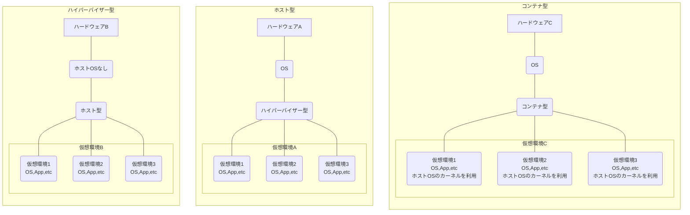
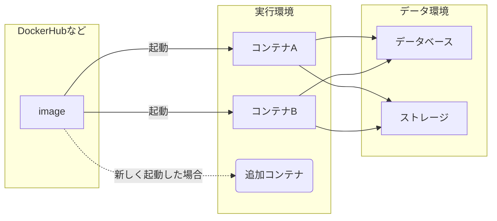
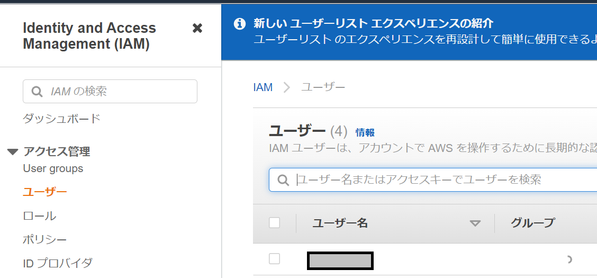
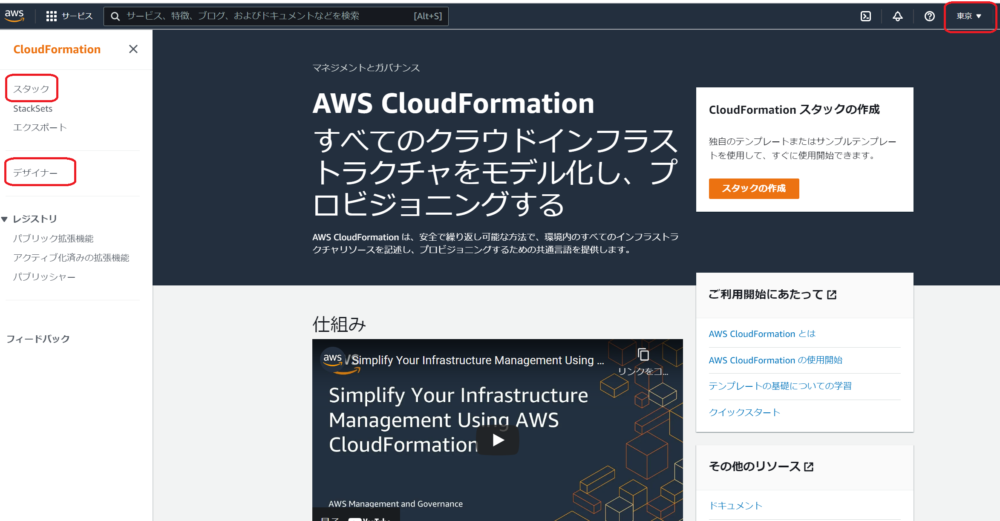

# Docker/Kubernetesを試したい

皆さん、Dockerを使ってますか？
当然、ナウでイケてるヤングな皆さんはDockerを使っていて、さらにはAWSやAzure、GCP上での展開とかもしているかと思います。  
でも、残念ながら私は手元でちょっと試すのにDockerを使ったことがあるぐらいで、運用での利用はもちろんないですし、Kubernetesについては触ったこともありません。
そんな僕も少しは若さが保ちたいと思い、今回はKubernetesをやってみたいと思います。ちなみにローカルの環境だといまいち使い道がないため、AWSの`EKS(Elastic Kubernetes Service)`を利用していきたいと思います。  
ついでに、参考図書(本記事の最下部を参照)がCloudFormationを利用してたので、これも解説しようかな、と思います。  

### 初めに用語の整理

1. Docker  
   仮想コンテナを提供するアプリケーションです。コンテナはVM機能とは違い、カーネル等の部分はホストOSをそのまま活用し、実行環境だけ切り出したようなものです

2. Kubernetes
   Dockerをオーケストレーションするものです。2014年にGoogle社主導で開発されたようですね。

3. AWS
   あまり説明する必要を感じないですが、Amazon社が提供するIaaSなどのクラウドサービスです。

4. CloudFormation
   AWS上で環境構築する際の構築内容を構成ファイル(yaml等)で記載できる機能です。構成ファイルを作成して、インポートすれば環境構築ができます。

5. EC2  
   AWSにおけるVMです。

6. EKS  
   AWS上で提供されているKubernetesのマネージドサービスです。

7. Fargate  
   AWS上で提供されているコンテナサービスです。ざっくり言えば、個別にDockerを使わずともコンテナを動かせるものです。  

8. ECR  
   Dockerイメージを登録・保存するサービスです。言ってみれば、DockerHubですね。  

9. pods  
   Kubernetesでの実行単位です。コンテナ単位で操作をする形ではなく、pods単位になります。基本的には1Pod->1コンテナが一般的ですが、Podには複数コンテナを紐づけられます。  

ざっくりとした説明ですが、この後もう少し細かく説明をしていきます。  

### 記事の流れ

やることがだいぶ長くなると思いますので、まずこの記事では全体の機能や用語を説明していきます。  
その後、順々に進めながら以下を説明して行ければと思います。  

1. CloudFormationの使い方
2. EC2、RDS、踏み台サーバ及びマネジメントコンソールからのコンソール操作
3. Docker DesktopとECRの使い方
4. EKSとKubernetesに関するデプロイ
5. Fargateの利用
など

### まず前提。DockerとKubernetes

開発やインフラ周りにあまりかかわってない方（私含む）は、Dockerはなじみがないかと思いますので、ご説明です。  
ITに関われば現代ではほぼ間違いなく使っているものとして、VMがありますよね。VMWareやVirtualBoxとかを使って、１つのハードウェアで複数のOSを動かす機能。  
はたしている機能はこれに近いのですが、これだとファットになりすぎていて、もっと提供機能が絞られているものだと思ってもらうといいかもしれません。  

ざっくりイメージは以下になります。  
これだと、ホスト型との違いが分かりづらいですが、カーネル部分を共有していて、軽量であることが最大の特長、といえるかと思います。  



#### なぜコンテナが必要なのか？

これをやる大きな目的として、マイクロサービスというものがあると思います。  
Webサービスが動作している環境、DBサービスが動作している環境、APIサーバ等が動作している環境、こういった各サービスで実行環境を切り分け、独立して開発・運用することで保守性など運用等がやりやすくなります。  

ざっくり分かりやすい例として、一般にサーバ上で何かアプリケーションを動かす際に、完全に独立はしてないですよね。言語の実行環境としてpythonやphpとかを使う、
apt等でインストールする各種ライブラリやOS機能を利用する、サーバ上でほかのアプリケーション等を使わないことはまずありえません。  

で、同じサーバ上でほかの機能を動かそうとすると、何かのライブラリをインストールしなきゃいけない、でそんな時に限ってライブラリの依存関係で既存モジュールをアップデートしなきゃいけないとかが起きる。  

まぁ、よく起きることだと思います。そして、安易にこれらをやると既存サービスに影響が出るかもしれないのでちゃんとテストするけど、想定外のところでバグを踏む、といった感じで。  

Dockerのように実行環境を切り出しておけば、こういった依存したアプリケーション等も全て個別に準備できます。  
おまけに、Dockerはimageを準備して各コンテナを動作させるものです。なので同じ環境をもう１つ動かす、とかも簡単にできます。この辺りがDockerのホントの良さかもしれません。  



これにより、スケールアウトさせることが非常に簡単になります。さらにはimageを修正しておけば、それ以降はコンテナが起動するたびに最新の環境で動作するので、環境管理もとてもやりやすい。流行るわけですね。  

#### Kubernetesって何？

上の環境を見て思うこととして、全体の管理が大変そうだな、というのがあると思います。  
こういった場合、１ホスト内であればDocker-Composeを使って、マルチコンテナの管理が行えます。しかし、本番環境は単一ホストで運用されていないことはとても多いと思います。  
じゃあ、どうするか？こういう時に使えるのがKubernetesです。これはDockerを使ったコンテナ環境のオーケストレーションができる機能です。  

さあ、これで仮想環境については説明は終わりです。  

### 環境の準備

----

**注意**  
`以下をやるとEC2などが起動するため、当然ですがお金がかかります。終わったら削除しましょう`

----

さて、テストを実施しますが、まずは今回の環境についてです。Docker環境については、今回はAWSを使って構成し、そのうえでテストしていきます。  
また、上述した通りコンテナにはFargateがありますが、まずはEC2を利用して構築し、その後にfargateも試してみたいと思います。  
基本的に構成はCloudFormationを使って構成しますが、それにプラスしてマネジメントコンソールを使って説明していきます。
そのうえで、まずはCloudFormationの使い方などを説明していきたいと思います。  

#### 利用ツールの準備

今回、環境としてはAWSを使い構成は基本的にCloudFormationを使います。ただ、手元のツールとしてはこれ以外も諸々使っています。  

1. [aws cli](https://aws.amazon.com/jp/cli/)
2. [kubectl(Amazon EKS)](https://docs.aws.amazon.com/ja_jp/eks/latest/userguide/install-kubectl.html)
3. [eksctl](https://github.com/weaveworks/eksctl)
4. [docker for windows](https://docs.docker.com/get-docker/)

これらを利用する上で、まずはアカウントの作成とAWS CLIでの初期設定が必要です。
AWS IAMで、AWS CLI用のユーザを作成します。  



作成が完了すると、アクセスキーとシークレットキーを確認でき、またその内容はCSVでダウンロードも可能です。これを使って設定しましょう。  

```cmd
C:\drive\tools\k8sbook\bin>aws configure
AWS Access Key ID [None]: アクセスキーを入力
AWS Secret Access Key [None]: シークレットキーを入力
Default region name [None]: デフォルトリージョンを入力(日本ならap-northeast-1)
Default output format [None]: 任意(私はjsonにしました)
```

さて、これで準備は完了です。  

#### CloudFormationの説明

CloudFormationはテンプレートファイルに沿って、自動的にインフラ構築をする機能です。  
インフラ定義はjsonやyamlで作成しますが、まぁマニュアルで作るなら`yaml`で作るのが一般的でしょう。jsonは構成情報として見やすさはないですからね。  

以下は、CloudFormationのダッシュボードです。この画面にて、重要なことは以下です。  
1. 構築するリージョンで開くこと（画面でいう**東京**というところ）
2. テンプレートファイルを読み込んだり、過去の実行を見るなら**スタック**を開く
3. 画面上で設計するなら**デザイナー**を使う



存在は知ってましたし、勉強で一回だけやりましたが、運用では使ってはいないです。ただ、AWSの様な大規模な構成を管理する上では必須だとは思います。  

正直、まずは必ずCloudFormationベースで作るって癖をつけておいた方がよさげ、ですね。  

#### EKSの利用確認

EKSについては、`eksctl.exe`を利用して作成し、その後の操作はkubectlを利用します。  
ちなみにこういう時どこに設定が保存されているか知りたくて知りたくて震える性分なので見てみました。どうやら`%userprofile%\.kube\.config`に入ってました。  

既にCloudFormationでVPCやサブネットなどの環境が構築されています。なので、これを利用したEKSを作成しましょう。  
以下コマンドで作成ができます。  
```ps
.\eksctl.exe create cluster --vpc-public-subnets サブネットID1,サブネットID2 --name eks-work-cluster --region ap-northeast-1 --version 1.22 --nodegroup-name eks-work-nodegroup --node-type t2.small --nodes 2 --nodes-min 2 --nodes-max 5
```
Note: versionはどんどん新しくなるのでもっと新しいバージョン指定が必要になると思います  

作成は結構時間がかかります。完了すればプロンプトがかえってきますので、そうなったら作業を続けましょう。  

作成が完了したら、まずはnodesを確認してみましょう。  

```ps
.\kubectl.exe get nodes
```

結果、ノードが２つ表示されたらOKです。  
次に、このノードが紐づくpodsを構成ファイルを利用して作成します。  

```yaml
apiVersion: v1
# 設定対象。今回はPodを作成するので、kindはPod
kind: Pod
metadata:
  # このpodsの名前
  name: nginx-pod
  labels:
    app: nginx-app
spec:
  # podsに紐づける対象
  containers:
  - name: nginx-container
    # コンテナイメージを指定
    image: nginx
    # このコンテナが利用するポートを定義
    ports:
      - containerPort: 80
```

実行するとpodsが起動します。この80ポートは現状ではグローバルとアクセスするサービスの紐づけがなされてません。そのため、これはportforwardを使ってアクセスしましょう。  
Note: ポートフォワードはsshでとても有名ですが、インフラでは必須の知識なので知らない方は是非調べてみてください。  

```ps
.\kubectl.exe port-forward nginx-pod 8080:80
```

テストが終わったらとりあえずはPodsは削除しておきましょう。  
```ps
.\kubectl.exe delete pod nginx-pod
```

この記事でやることは、とりあえず準備までなのでこれで終わりです。では次に今後のやることを書いていきます。  

#### この先でやること

上に書きましたが、この先では以下のようなことをやっていきたいと思います。  

1. CloudFormationの使い方
2. EC2、RDS、踏み台サーバ及びマネジメントコンソールからのコンソール操作
3. Docker DesktopとECRの使い方
4. EKSとKubernetesに関するデプロイ
5. Fargateの利用

記事全体を通してやりたいこととしては、wordpressをfargateベース及び通常のEC2ベースのコンテナで構築してみようかと思います。  
そのために以下のようなすみ分けをさせて行きたい形ですね。

* ネットワーク構成など基盤としてVPC・IGW・サブネットetc
* データベースにはRDS
* 画像等のデータ保存にはS3
* 構築するのにはCloudFormation
* コンテナイメージの作成と更新にはDocker DesktopとECR
* 全体のオーケストレーションにはEKS
* 保守管理のために踏み台サーバとSystem Manager

### 参考資料
1. [Kubernetes on AWS　アプリケーションエンジニア　本番環境へ備える](https://www.amazon.co.jp/Kubernetes-AWS-%E3%82%A2%E3%83%97%E3%83%AA%E3%82%B1%E3%83%BC%E3%82%B7%E3%83%A7%E3%83%B3%E3%82%A8%E3%83%B3%E3%82%B8%E3%83%8B%E3%82%A2-%E6%9C%AC%E7%95%AA%E7%92%B0%E5%A2%83%E3%81%B8%E5%82%99%E3%81%88%E3%82%8B-%E4%BC%9A%E6%BE%A4/dp/4865942351/ref=asc_df_4865942351/?tag=jpgo-22&linkCode=df0&hvadid=342534585338&hvpos=&hvnetw=g&hvrand=8429516905956934490&hvpone=&hvptwo=&hvqmt=&hvdev=c&hvdvcmdl=&hvlocint=&hvlocphy=1009302&hvtargid=pla-908198546133&psc=1&th=1&psc=1)  
   著者：会澤康二氏、佐藤和彦氏

2. [参考図書(No1)に関するGitHubリポジトリ](https://github.com/kazusato/k8sbook)

3. https://ja.wikipedia.org/wiki/%E3%83%9E%E3%82%A4%E3%82%AF%E3%83%AD%E3%82%B5%E3%83%BC%E3%83%93%E3%82%B9

4. https://dev.classmethod.jp/articles/cloudformation-beginner01/

5. https://kubernetes.io/ja/docs/reference/kubectl/cheatsheet/