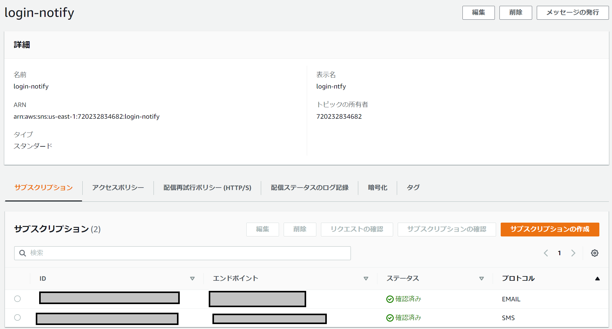
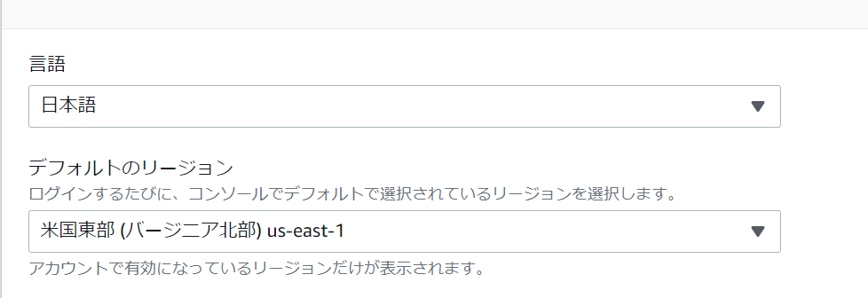

# AWSマネジメントコンソールのログイン通知

検証用でしかほぼ使ってないため、結構おざなりになっていましたが、AWSのログイン通知などをもう少しちゃんとやっておこうと思いたち、やりました。  
作業メモ的な意味も含め、残しておきます。

やりたいことはIAMユーザがコンソールログインした時、ルートユーザがコンソールログインしたときでそれぞれログを飛ばします。  
一応、ルートユーザのログインは重要度を高めたいので、内容を少しカスタマイズすることを考えてます。

以下サイトを参考に実施しました。  

https://dev.classmethod.jp/articles/aws-management-console-sign-in-notice/

ざっくりやったことは以下です。  

- SNSで通知に関する設定を実施
- CloudTrailで証跡の作成とCloudWatchへの通知設定(※)
- eventbridgeで通知対象のイベントを設定
    * 対象イベント向けのフィルタ実施
    * 通知メッセージ用にカスタマイズ実施
- CloudTrailでログ情報のチェック(これに合わせてちょっとした変更)  

※証跡設定が必要かどうかちょっとわからなかったのですが、やらないとできなかったので記載します。  

### SNSの設定

基本的にトピックというものを作成し、その後サブスクリプションで通知先を設定します。  

#### トピックを作成

トピックの作成にて、スタンダードを選択し名前と表示名ぐらい埋めれば完了です。  


- タイプ: スタンダード
- 名前: 任意
- 表示名: 任意(10文字まで使ってメールの送信者名などに使われます)

#### サブスクリプションを作成

通知先を登録して作成すればOKです。
できるものは色々ありますが、簡単に使えるものとしてメールとSMSがあります。  

作成したトピックでサブスクリプションの作成ができます。  



開いた先ではプロトコルのプルダウンをクリックして、メールやSMS、Webフックなどを選択します。  


これで、サブスクリプションの設定は完了です。  

### CloudTrailで証跡設定

CloudTrailで証跡の作成をします。ダッシュボードにあるクイック作成で作ってしまいます。  


作成した証跡を開き、CloudWatch logを設定します。  


ほぼそのままでOKですが、IAMロール名だけ指定します。  


これで完了です。  

### EventBridgeの設定

EventBridgeの設定を開き、ルールの追加を行います。  


ルールは、私はIAM用で「iam-login-event」、root用で「root-login-event」という２つのルールを作成しました。  
作成画面に入ると、以下のようにイベントバスやルールタイプを選択する画面がまず出てきます。  
以下のように設定しましょう。  

- 名前: 任意
- 説明: 任意
- イベントバス: defaultでいいです
- ルールタイプ: イベントパターンを持つルール


さて、この次にイベントパターンの作成に入ります。ここが一番はまりました。。  
というのも、イベントの内容がCloudTrailで見たものと異なっていたり、フィールドとして指定できないものがあるようでこの辺りにはまりました。  

まずは、マッチングテストができるようにサンプルイベントについて`AWSイベント`を選択し、プルダウンから`AWS Console Sign In via CloudTrail`を選びましょう。  
Note: プルダウンでConsoleぐらい入れると出てきます


以下のような形でイベントパターンを入力します。ここで大事なこととして、`eventName`などのフィールドは使えないということですね。  
画面はルートの場合ですが、IAMユーザの場合もほぼ変わりません。  


**rootユーザのパターン**

```json
{
  "source": ["aws.signin"],
  "detail-type": ["AWS Console Sign In via CloudTrail"],
  "detail": {
    "userIdentity": {
      "type": ["Root"]
    }
  }
}
```

**IAMユーザのパターン**

```json
{
  "source": ["aws.signin"],
  "detail-type": ["AWS Console Sign In via CloudTrail"],
  "detail": {
    "userIdentity": {
      "type": ["IAMUser"]
    }
  }
}
```

これが終わったら、次に通知先を設定します。以下のようにSNSの作成したトピックを指定しましょう。


この後、ログインし直すと以下のように通知が飛んできます。  


この内容はJSONデータが生に飛んできており、とても見づらいので修正しましょう。  
こういう場合、EventBridgeのターゲット設定にて行えます。以下のように追加設定を開き、入力トランスフォーマーを選択、その後`入力トランスフォーマーを設定`を開きましょう。    


入力トランスフォーマー画面では、飛んできたログをベースに設定していくのが一番です。なので、サンプルイベントは自分で入力を選択して通知の内容を張り付け、JSONを整形をクリックしましょう。


次に、このログの中からどの情報を抽出するか、フィールド名付きで指定します。これもJSONを使います。  
以下は例ですが、例えば最初のeventとは、フィールド名：`event`、値:`detail内のeventName`という形で抽出しています。  

```
{
  "event": "$.detail.eventName",
  "sourceIPAddress": "$.detail.sourceIPAddress",
  "username": "$.detail.userIdentity.userName",
  "usertype": "$.detail.userIdentity.type"
}
```

このフィールド抽出が終わったら、テンプレートというものを設定します。これは上でフィールドとして抽出したデータを`<>`で括って指定する形にて、文章に埋め込みます。  

`"Root Login Notification. event <event> with User <username> from <sourceIPAddress>"`

これが完了したら作成してしまいましょう。そうすると通知が飛んでくるようになります。  

さて、これで設定自体は完了となります。最後に、コンソールログインのログがなぜかCloudTrailで見れない？？という事象が起きていたのでそれについてメモ書きしておきます。  

### ConsoleLoginのログに関して

そもそも、コンソールログインするログはどこで見れるのか、確認しておきましょう。  
CloudTrailという機能を見ると、こういったイベントが見れます。  
実際にCloudTrailにアクセスするとメニューに`イベント履歴`というものがありますので、これを開いてチェックする形です。  


アクセスしたら、検索機能で`イベント名=ConsoleLogin`で検索します。そうすると過去のログイン情報が出てきます。  


で、ここを見て見ると気づくことがあります。それは、ログがないことがある？ということです。これはリージョンを色々かえって使ってる人で起こると思います。  

#### ログインログがないのはなぜか？

ログインのログがないことについて意味不明で色々試していたら、わかったこととして、ログイン時に開かれるサービスとそこで選択されているリージョンに依存していることがわかりました。  
ちなみに参考になったのは以下のサイトです。  

https://dev.classmethod.jp/articles/cloudtrail-console-login-event/

まず、整理としてログ情報はグローバルと各リージョンのログがあります。  
当然、サービスにもグローバルのものと各リージョンのものがあります。(S3とかIAMとかはグローバル、リージョン単位はEC2とかVPC
VVPCですね)  
Note: グローバルのサービスに関するログはus-east-1(バージニア北部)になります。  

ここでわかりづらいのは、ログイン時に開かれているリージョンが例えば東京の場合、このログは東京リージョンのCloudTrailで見ることができるようです。  
Note: 実際、私は北カリフォルニアにログがありました  

ということで、わかりづらいのでとりあえずデフォルトリージョンを`us-east-1`にしておきました。  
アカウントをクリックして、メニューから設定をクリックし、デフォルトリージョンを変更する形です。  




本記事は、以上となります。ありがとうございました。
