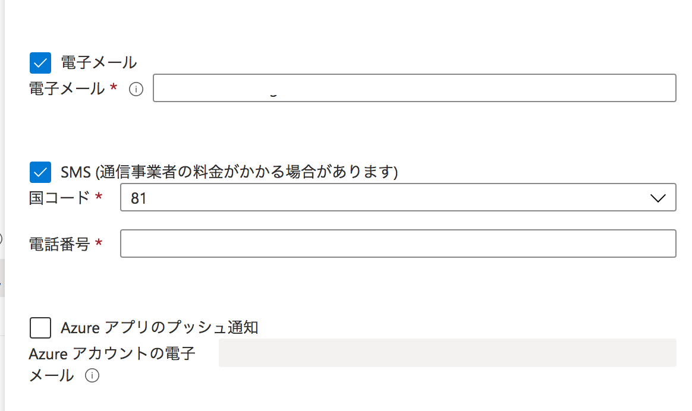

# コスト管理はしっかりしよう、という話

現在、Azureを使ったサーバ作成etcを行っているが、その中で笑えない(でも笑うしかない)ミスをしてしまった。。  
で、このままでは泣くに泣けないので、せめてここに書いて後世の活かそうと思う。  
ちなみにこの記事は色々書くが「Azure Subscriptionのコスト管理を使おう！！」ということだ。  

### 何が起きたのか？

じつは、Azureのセキュリティ機能であるDDoS ProtectionとFirewallを不必要に動かし続けてしまい、
10万請求されることになった。。。  

悲しいコスト画面を以下に上げておく。
  

102.5K。つまり**10万**である。。  
これを初めて見つけた時、まだ８万ちょいだったが、Azureのコスト表示（というかIaaSのコスト表示はほぼ全て）リアルタイムではない。  
即座に止めたが、その後も費用がグングン伸びていくのを見て、もうやめてー！！と叫びそうになった。  
当然だが、無料利用枠は吹っ飛んで、この先の勉強は全て自費となった。まぁ、普通に使う分には少額だから全然いいのだが。  

さて、なぜこうなったかは単に私がバカだからということに要約されるが、それだけだと意味がないので経緯と今後の対策を書いていく。  

### 何故こうなったか？

私は、今までAWSを使っていた。これ以外にはGoogle翻訳のAPI利用などのために若干だがGCPを触ったことがある。しかし、Azureはなかった。  
とはいえ、Azureは大きな点としてActiveDirectoryを持っており、その他もPaaSレベルのサービスが多いという印象。  
今後は色々使われていくだろうな、ということで興味は強く持っていた。  
で、検証をスタートした。色々触ってみるに当たって、MicrosoftはLearnで触り方などの教材を公開しているが、これがかなり豊富になっている。  
なので、基本的にはMicrosoft Learnを使って勉強をしているわけだが、その中でAzure FirewallとDDosProtectionについて確認していた。  
Note: これは、私がセキュリティエンジニアだから。というのが大きい。  

そして、Learnの中で以下はAzureDDoSProtectionの演習も込みでやっている。  
[ネットワーク セキュリティを設計して実装する](https://docs.microsoft.com/ja-jp/learn/modules/design-implement-network-security-monitoring/)

これを触っている時に事件は起きた。当たり前だが、この演習をやると一時的にDDoS ProtectionとFirewallを有効にして利用する。  
とはいえ、演習の最後で該当の設定は削除することになっており、ほとんど時間がかからないので、手順通りにやればお金はほぼかからない。  
まぁ、ここまで書けばわかると思うが、私はこの最後の設定を消すことを忘れたのだ。  
いや、正直にいうと意図して残した。理由は少しの間様子を見て、どんなログが出るのか、といったことをみたかった。そして、その後に少し用事をこなすうちに忘れたのだ。  
これが起きたのが1月22日。停止したのが1月29日。約１週間のうちに10万となった。  

### 間違いを起こした要因  

#### 1. いくらかかるかを事前に調べてなかった  

ある意味これが主要因である。  
高額なサービスであると事前に認識していれば、当然センシティブに扱った。  
しかし、Learnでなんとなくやりながら、漫然とそのままにしてしまった。。。  
事象が起きた後、金額を見てヒエー！！という気持ちである。。  
[firewallの金額](https://azure.microsoft.com/ja-jp/pricing/details/azure-firewall)  
##### コスト：**¥144/時間**  

[DDosProtectionの金額](https://azure.microsoft.com/ja-jp/pricing/details/ddos-protection)  
##### コスト：**¥339,818/月**    

#### 2. コストアラートを設定してなかった

もう１つは、こういったことが起きた時にアラートをあげる機能である、Azure CostManagementを使ってなかった。  
なので、もっと早く気づくことができなかった。  
１の方は、同じことをしないように気をつける、ということが必要だが、とりあえずは２の設定をする。これで同じことが起きた時に早く気づくことができる。  

ここからは、今後の対策としてコストアラートの設定方法を記載する。  

### コスト管理設定  

さて、長々とした前置きを終わらせ、早速設定をする。  
まず、Azureではサブスクリプションという設定がある。同じアカウントでも金額設定などをこのサブスクリプション単位で設定できる。  

では、まずはAzureのポータルにアクセスし、サブスクリプションを開く。  
[AzurePortalを開く](https://portal.azure.com)  

検索で、「subscription」を検索すると鍵のアイコンのSubscriptionというものが表示されるので、これをクリックする。  

左側のナビゲーションメニューから、コスト管理の予算を開く。  
  

ここで、追加をクリックすれば予算を設定できる。私は課金月単位の予算で、1万とした。  
  

設定をしたら、次へをクリックする。そうするとアラート設定が行える。  
アラート設定をする上で、まずはアクショングループの作成となる。そこで通知の設定として、以下にあるようにメールとSMSへ通知するように設定した。  
  
Note: アクショングループは、警告条件設定で作成画面に飛べる  

その後、警告条件としてコストとどのような割合になったら飛ぶかを設定できる。私は、50%、100%、200%と設定した。  
  

これで、作成をクリックすると完了となる。今後は、使いすぎをリマインドしてくれるというわけだ。  
まぁ、自分のようなうっかりさんにはとても便利と言えるだろう。  
