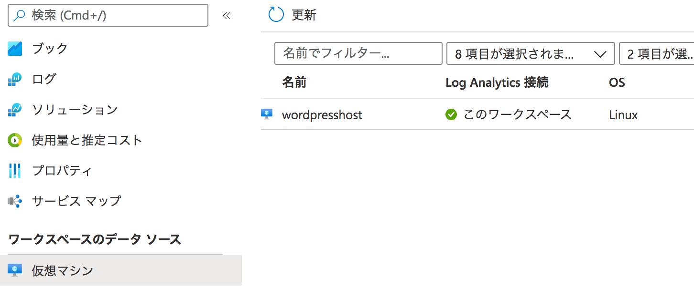

# Azureでログ解析(pt1:LogAnalytics編)

私のブログサイトはAzure上でWordPressを動かしている。  
で、Azureにはログを解析するためのSIEMとしてSentinelがあり、監視機能としてAzure Insights(Azure Monitor)がある。  
なので、これを使って見たい！  

ということで、私のサイトのアクセスログその他をSentinelで解析させてみようという話となる。  
ただ、内容はかなり長くなりうると思うため、まず本記事ではLogAnalyticsでログの可視化までを記載する。  

## まずはAzureの構成に関する説明  

Azureでは、LogAnalyticsというモジュールがある。  
これはいってみればログ管理ツールであり、ログの収集と別システムへのログ送信などが行える。  
このログをAzure Insightsなどといったもので監視することとなる。  

参考: https://docs.microsoft.com/ja-jp/azure/azure-monitor/agents/data-sources

このログの収集と検索ができるLogAnalyticsや監視機能であるInsightsなどを統合した大きな機能がAzure Monitorとなる。（らしい）  

補足:書いてる人はなんとなく自分の理解を書いていますが、Azureは触り始めたばかりで**素人レベル**です。なので**間違ってるかも**、ということをご理解ください。

## ログの取り込みをおこなう

まずは、簡単にデータソースの仮想マシンに接続する。  
データソースのVirtual Machinesで該当ホストをクリックし、接続する、をクリックすると接続できる。  

