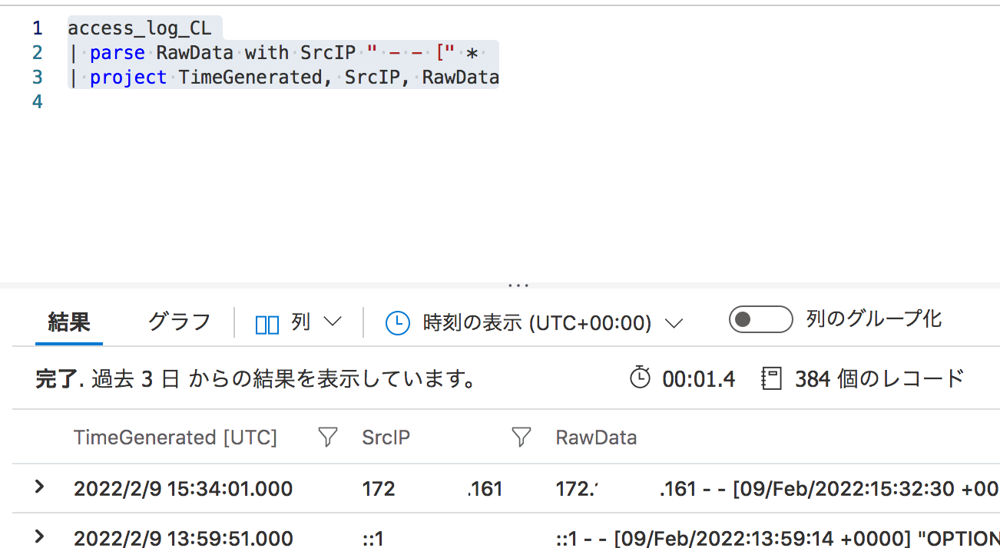

# KQLを使ってログを調べよう(pt1)  

実は、Sentinelの使い方を書こうと思っていたが、そもそもログを調べる方法であるKQLのクエリについてその前に書いた方がいいのでは？  
ということを感じたので、まずは前置きとしてこのKQLについて触れていきたい。  

ちなみに、なぜそれが必要と感じるかというとSentinelはこのKQL(Kustoクエリ言語)でハンティングをしているからだ。さらに、ログを見たい時にも当然だがこのクエリ言語を利用する。  
そのため、LogAnalyticsでログを見たい時には必須と感じた。  

とはいえ、まだ勉強中の身のため、KQLについて知らないことの方が多い。  
とりあえずは、現状把握しているクエリコマンドとそれを使った検索例を示して見たいと思う。  

ちなみに。。ここに書いているが、正直MSのラーニングパスを受けた方が体系的に理解できると思う。なので、きちんと学びたいなら、これを見ることを推奨する(じゃあこの記事いらねーだろ、というツッコミは厳禁)。  

[Azureラーニングパス(SC-200: Kusto クエリ言語 (KQL) を使用して Microsoft Sentinel のクエリを作成する)](https://docs.microsoft.com/ja-jp/learn/paths/sc-200-utilize-kql-for-azure-sentinel/)

## KQLのコマンド  

KQLは調べれば調べるほど色々なコマンドがあり、正直調べきれないと感じている。  
しっかり調べてたら調べ終わる頃には新しい機能が追加されてそう、てぐらいに果てしなく感じる。  
なので、あくまでも基礎的なコマンドをいくつか、目的別に記載させてもらう。  
Note: まぁ、これもあってタイトルはpt1とした。  


### 用語について  

これから書くことを理解する上で、必要な用語をざっくりとここに記載する。  

1. KQLの目的  

すでに書いているが、KQLはログを分析するためのクエリ言語となる。  
ここで重要なこととしては、ログを検索するだけではない、ということ。フィールドの値を足し合わせたり、統計情報をとったり、ログのフィールドから部分抽出をしたり、グラフ化コマンドで可視化させるといった様々なことが行える。  
この辺りの利便性は、Splunkを知っていると、Splunkサーチ言語(SPL)に近いと感じると思う。  

2. KQLとSQL  

まぁ、名前が似ているということもあるが、UNIONやJOIN、whereなどの同じ名前と効果のコマンドがある。  
とはいえ、大きく異なるものであるため、用語等が少し似ているもの、ぐらいに考えるとちょうどいい。  

2. テーブルについて  

ここを理解しておかないと迷子になると思うので、よく理解しておきたい。  
KQLでは各ログソース(及びログ種別)をテーブルとして定義している。  
なので、これ以降にテーブルをまたがって検索できる、などと書いた時は「ああ、複数のログデータを横断して検索できるんだな」みたいに理解してほしい。  

### 検索する  

全ての基本といっていい、ログの検索コマンド。  

| コマンド | 説明                                                                         |
| -------- | ---------------------------------------------------------------------------- |
| where    | ログ検索用のコマンド。フィールド指定が必須。<br />１テーブルのみの検索             |
| search   | フィールドを指定しないで検索できるコマンド。<br />複数テーブルにまたがって検索可能 |

### テーブル表記する  

ログを単純に検索して例えばJSONデータが大量に表示されても、事象の全体像を把握することは難しい。  
そういった時は重要なフィールドに限定したテーブルとして確認することが重要となる。  
テーブル表記をした場合、重要なことは指定のフィールドでデータをソートすること。また、ソート後は特に重要なものに絞るといった理由で上位数件のみを表示する、といったことも必要となる。  

| コマンド      | 説明                         |
| ------------ | ------------------------------------------------------------------------------------------------ |
| project      | テーブル形式に変換するコマンド。<br />演算子を使ってあたいの結合をしたフィールドにするなども可能 |
| project-away | いくつかのフィールドをテーブルから消す時に利用|
| sort         | 指定フィールドでsortするコマンド|
| top          | 指定した整数分だけ上位数のレコードを返す|

### 統計情報を取る・グラフ化する    

これはテーブルデータの続きと言えるが、基本的にログは大量のデータとなる。これを単純にテーブル化するしても「？？？」と思考が止まるだけ、というのもあるだろう。  
Note: もちろん、重要なログにフィルタするという処理をするわけだが、調査の取っ掛かりでは、何が重要かが漠然としていて掴めていないことも多い  

であれば、様々な観点でそのログを集計するのがいいだろう。  
エラーであるなら、そのエラーはどの端末で多くおきてるかを見て見る。  
トラフィックのスパイクがおきてるなら、同じ事象がおきてる時はどういう時か、時間やデータタイプでの分布をとって見る。  
HTTP 401や403の不正アクセスにつながりかねないHTTPエラーが大量に出てるなら、アクセス元のIPで統計を見て、多重に行なっているものを特定・フィルタする。  

こういった概念的な(漠然とした)事象がおきている時に、何をすべきかを検討するための材料として、統計かすることはとても役に立つ。  

| コマンド    | 説明                    |
| --------- | ------------------------|
| count      | レコード数のカウントをするコマンド|
| summarize  | subcommandと渡されたフィールドによってログ内容を集計及びサマライズするコマンド                   |
| render     | グラフ表示など視覚化するコマンド|

### ログデータから特定部位を抽出する  

例えば、WebのUserAgentを見てると、たまにcurlやpowershell、pythonのUAがついてたりすることがあると思う。(見たことがある程で進める)  
当然これらはブラウザではなく、クローラであったり何かの準備(テスト)であったりということになる。  
まぁ、有り体に言えばスキャンであったりブルートフォース攻撃であったり、それ以外にも不正なクエリを送りつけたりするのではないかという懸念を持つ。  

こういった時にログデータの部分を抽出してそれを検索するのは大きな意味を持つだろう。(理由はcurlであってもバージョンで様々あったりするというブレを無くしたいから)

こういう時のために、ログデータの抽出するコマンドは以下となる。  

| コマンド  | 説明                                   |
| -------- | ------------------------------------- |
| parse    | フィールドをparseするコマンド             |
| extract  | フィールドの部分を正規表現で抽出するコマンド |

### その他    

複数のテーブルを結合して表示することや、検索全体で利用するような変数の定義をすることができる。  
変数の定義は、宣言的な書き方をしたい時に使うイメージで考えている。  
クエリデータは基本形を置いておいて、最初に宣言した変数次第で挙動の切り替えができるようにしたい時などに用いる。  

| コマンド       | 説明                                   |
| ------------- | ------------------------------------- |
| let           | 変数や関数を定義するコマンド               |
| extend        | カスタムフィールドの定義コマンド            |
| union         | 複数テーブルを行の積み上げで結合            |
| join          | 複数テーブルをキー値を用いて結合            |
| externaldata  | フィールドの部分を正規表現で抽出するコマンド  |

UNIONとJOINのテーブル結合の違いはおそらくイメージはつくだろうが、念のため説明する。  
UNIONはわかりやすい。複数のテーブルの行を積み上げるだけだ。イメージは以下となる。  

1. テーブルA  

| columnA | columnB |
| ------- | ------- |
| A       | B       |

2. テーブルB  

| columnA | columnC |
| ------- | ------- |
| AA      | C       |

3. UNION後  

| columnA | columnB | columnC |
| ------- | ------- | ------- |
| A       | B       |         |
| AA      |         | C       |

対して、JOINはそもそもタイプ次第で結合方法が大きく異なる。  
例えば、以下のようにJOINを利用する。  
```kusto
Table_A
| join [JoinParameters] (
  Table_B
) on Attributes
```

この時、Attributesがキー値となる。  
そして、JoinParametersに指定するkindという値次第で挙動が変わる。  

| kind        | 説明(結合結果)                                                                                                |
| ----------- | ------------------------------------------------------------------------------------------------------------- |
| leftanti    | Bに一致するものがない、Aのすべてのレコード                                                                    |
| rightanti   | Aに一致するものがない、Bのすべてのレコード                                                                    |
| innerunique | Aの 1 つの行のみが on キーの各値に対して照合。 出力には、Bの行のこの行と一致するそれぞれの行が含まれる。      |
| leftsemi    | Bに一致するものがある、Aのすべてのレコード                                                                    |
| rightsemi   | Aに一致するものがある、Bのすべてのレコード                                                                    |
| inner       | 出力には、ABの一致する行のすべての組み合わせに対応する行が含まれる                                            |
| fullouter   | 一致するものがない場合も含めて、ABのすべての行に対応する行が含まれる。 一致しない出力セルには null が含まれる |

よくある、AND/OR、NAND/NORの時に使う円が２つ重なっているあのイメージである。  

これらがまず調査をする上で、初心者として個人的に押さえておくべきと思ったコマンドとなる。  
今度はこれらを実際に使って見たいと思う。  

とはいえ、今の所私ができるログけんさくはほとんどないが。。とりあえずブログのログを検索してみよう。  

で、まずは[前回の記事](https://blog.tech-oshiba.com/2022/02/09/azure%e3%81%a7%e3%83%ad%e3%82%b0%e5%88%86%e6%9e%90%e3%82%92%e3%81%97%e3%82%88%e3%81%86%ef%bc%81/)で作ったログを見て見る。  
前回の記事では、apacheのログファイルをカスタムログとして定義した。そのログのテーブルが以下である。  
- access_log_CL: 私のAzureログテーブル  

まぁしつこいかもしれないが、ログを見る時はLogAnalyticsで見る。ここで、全般のログを見るとクエリを投げてログを調査できる。  
最初に、このテーブルを単純に見てみる。そうすると、以下のようになっている。  
  

さて、そうするとログの内容は以下のようにRawDataというフィールドに固めて入ってしまっている。そのため、まずはparseをする必要がある。  
ちなみに取り込み時点でextractする方法もあるようだが、わかっていない（すいません。わかったら別途書きます）。  
なので、クエリの中でparseするやり方で進めていく。
  

まずは、テーブル表記に変えて見る。  
```kql
access_log_CL
| project TimeGenerated, RawData
```


さて、ここから今度はソースIPをparseして見る。  
その上で、ログの構成は以下のようになっている。  
```
192.241.213.126 - - [09/Feb/2022:15:10:11 +0000] "GET / HTTP/1.1" 200 67568 "-" "Mozilla/5.0 zgrab/0.x"
```
まぁ、よく見たことがあるaccesslogだと思う。これをざっくり区分すると以下になる。  
`ソースIP - - アクセス日時 "メソッド URI HTTPバージョン" ステータスコード 応答データのサイズ "-" UserAgent`

これがわかれば、次にこの構成に基づいてログをparseする。  
このログでは、先頭がソースIPのため、先頭から" - - "までを抽出する。  

```kql
access_log_CL
| parse RawData with SrcIP " - - [" *
| project TimeGenerated, SrcIP, RawData
```

そうすると、以下のようにソースIPのフィールドが追加されている。  

  

さて、parseのところを説明する。  
`parse パースするフィールド with 変数名 ログの切れ目 {同じことを繰り返す}`  

ここで、一部のログは見ずに飛ばす時、*を使う。例えば以下のように書くと、`ここからみる`という箇所まではparseしない。  
`parse パースするフィールド with * "ここからみる" 変数名 ログの切れ目 {同じことを繰り返す}`  

*の使い方はこんな感じで途中を飛ばすにも、最後を飛ばすのにも使える。  
で、`SrcIP`をparseした場合は、先頭からマッチさせたいので最初から変数(フィールド名)とログの切れ目を記載。その後ろに*をつけている。  
- フィールド名: SrcIP
- ログの切れ目: " - - ["
- 後ろは読み飛ばし: *

という形になる。これでSrcIPのparseは完了。同じ要領で他のフィールドもparseしていく。結果は以下のようなクエリになる。  

```kql
access_log_CL
| parse RawData with SrcIP " - - [" * "+0000] \"" Method " " URI " HTTP/" * "\" " Code " " * "\"" * "\" \"" UserAgent "\"" *
| project TimeGenerated, SrcIP, Method, Code, UserAgent, RawData
```

これでparseは完成。実行すると以下のようにログデータを見ることができる。  

  

よかった。正しくparseされている。まぁ、これでやっと準備ができたというレベルなのだが。。  
さて、まずは403のリクエストを見てみよう。  
単純にwhereでステータスコードが403のリクエストを検索する。  
```kql
// 追加分のみを記載
| where Code == "403"
```

そうすると以下のようにステータスコードが403のもののみが表示されている。  
この場合はログは１つだけなので、あとはこのログを調べて見る、というところだろう。(まぁ403が１つ出てるだけなら基本大した問題ではないと思うが)  
  

さて、次にHTTPリクエストについて、200番台(アクセス成功)以外のものがどれだけ出ているか見てみよう。  
今度は、ステータスコードでカウントしてみる。  
```kql
| where not( Code startswith "2" )
| summarize count() by Code
```

そうすると、以下のようにCode毎での件数が表示される。

  

これで、とりあえずログの検索方法は完了となる。最後にたとえば以下のようにrenderコマンドをつければ円グラフにしたりできる。  
`| render piechart`

  

今回は、ここで終了とする。ログの調べ方についての基礎と言えるが、ここからさらにどのようにログを調べていくかを説明していきたいと思う。

## 最後までありがとうございました!
