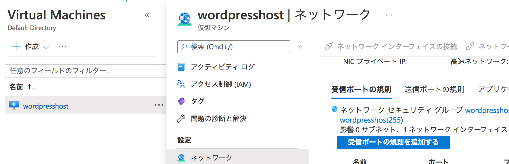

# SecurityGroupで通信制限をしよう！

別途ブログで記載したが、log4shellのコマンド送信がなされた。  
なので、このlog4shellの送信先とマルウェアがホストされている通信先(c2)への通信をブロックする。そのうえで、ホストはAzure上で展開されているため、Azureセキュリティグループでブロックする。  
Note: AzureFirewallもあるが、トラウマがあるし、私みたいな貧民（というか個人アカウント）にはキツイのでセキュリティグループで制御する  

## Azureセキュリティグループって何？  

Azureでは、公式のFirewallもあるが、簡易な通信制御であれば、セキュリティグループが利用可能である。  
このセキュリティグループでもスイッチでいうACLと違い指向性による設定ができる(ステートフルである)ため、受信と送信の制御ができる。  
ちなみにこういった設定はAWS(AmazonのIaaS)でもできるが、Azureではネットワークレベルでもできる。この点はAWSではACLレベルであるため、違いがある。  
Note: 2022/02/05時点。  

さて、このセキュリティグループを利用して以下の設定を行う。  
受信規則: 198[.]98[.]61[.]124 DENY
送信規則: 150[.]136[.]111[.]68 DENY

まぁ、実態としては受送信どちらもとりあえずブロックする方がいいが。とりあえずこれに則って設定していこう。  

##### まずは設定画面に移動   

AzurePortalに移動し、virtual machinesを開く。  
ネットワークを開くと、受信ポートの規則と送信ポートの規則がある。これが、受送信のルール設定となる。  
以降は、受送信のルールを設定していく。どちらもやることは同じだが、念のため分けて記載する。  

##### 受信設定   

受信ポートの規則を開き、受信ポートの規則を追加するをクリックする。  
- ソース: IP Addresses  
- ソースIPアドレス: 198[.]98[.]61[.]124/32
- 宛先: Any
- サービス: Custom
- 宛先ポート範囲: *
- プロトコル: Any
- 優先度: 他よりも低い値を指定(私は100を指定)  
  Note: 低い方が優先  
- アクション: 拒否    

##### 送信設定   

受信ポートとやることは同じであるが、宛先に指定する点が異なる。以下が設定となる。  
- ソース: Any
- 宛先: IP Addresses  
- ソースIPアドレス: 150[.]136[.]111[.]68  
- サービス: Custom
- 宛先ポート範囲: *
- プロトコル: Any
- 優先度: 他よりも低い値を指定(私は100を指定)  
  Note: 低い方が優先  
- アクション: 拒否    

さて、これで該当IPからの通信をブロックできるようになった。私としては、これで安心である。  

## 終わりに  

Azureのセキュリティグループはなかなかにわかりやすいし、使いやすいと感じた。  
とはいえ、これはEnterpriseレベルで管理することを想定した時には、という気がする。個人レベルでサクッと使うためにはできることは少ないけど、設定がシンプルなAWSの方がとっつきやすいだろうな、とも感じている。  
この辺りは、難しいものである。  
