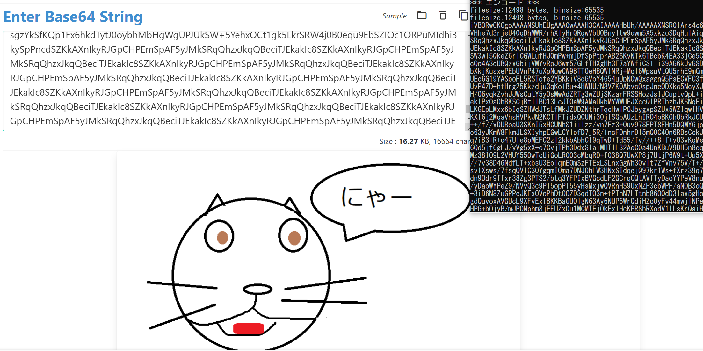

# まずはC++言語の勉強

-----
### **この記事の内容**  

DLLベースのマルウェアを理解するために、まずはC++の使い方を学んでます。この記事では、以下を書いてます。  
1. 基本的なプロジェクトの作り方
2. ファイルの読み書き
3. コマンドラインでの処理の切り替え

-----

この先に進むために、まずはC言語自体を勉強しないといけない、ということに気づき、この記事を書いてます。  
とはいえ、この記事では細かいまでテストできないので、まずは以下ができることを試していきたいと思います。  

1. ファイルの読み書き  
2. HTTPでのアクセス  
3. プロセス起動
4. レジストリ操作
5. WindowsAPIの操作
6. DLLファイルのロード
7. 各種機能の外部ファイル化

ざっくりやり方を確認した後に、すべてをDLLから実行できるように試していきましょう。  
ちなみに以前の記事から引き続きVisualStudion2022を利用します。あとバリバリ他のサイトを参考にしてますので、最後に参考サイトを記載させていただきたいと思います。  

### まずはプロジェクト作成とHelloWorld

とりあえず、プロジェクトの作成をしていきます。プロジェクトは空のプロジェクトにて開発を始めます。  


そうすると、ソースファイルも含め空で作成されます。この状態でまずはソースファイル(.cpp)を作りましょう。  
私は、プロジェクト名を`testdev01`、ソースファイル名を`main.cpp`にしました。  


さて、こうすると空のファイルが作成されます。まずは、HelloWorldと表示だけしてみましょう。  
最小レベルで以下のソースを実行します。  

```c
#include <stdio.h>
 
int main(int argc, char *argv[]){
	printf("HelloWorld");
}
```

実行結果は以下となります。ちゃんとHelloWorldが出てますね。まずは最初の1歩が完了です。  


### ファイルの読み書き  

まずはやろうとしていることの中で最も簡単と思われる、ファイルの読み書きをしてみたいと思います。  
とはいえ、前回の記事でHelloWorldのついでにやった気がしますが、今回もおさらい込みでやりましょう。  

まずはファイルの書き込みと読み取りをしたいと思います。ちなみにデバッグ実行時にファイルパスはプロジェクト直下になってしまうため、デバッグフォルダを指定してます。  

まずは書き込みを試します。 やっていることは単純で、以下の内容になってます。  

- ファイルオブジェクトを作る  
- w(新規作成)でファイルを開く
- 書き込んでクローズ

`testfile4IO.txt`というファイルにHelloWorldが記載されてることを確認しました。  

```c
int main(int argc, char *argv[]){
    char fname[] = "x64\\Debug\\testfile4IO.txt";
    FILE *fp;
    fp = fopen(fname, "w");
	fprintf(fp, "HelloWorld\n");
    fclose(fp);
}
```

さて、次に読み取りを試します。で、気づきましたが読み取って変数に入れる方がどうやらめんどくさい処理が多いようです。  

なので、まずは読み取って画面表示を試します。  
さっきのコードに追記して以下を試してみます。これで、画面上にHelloWorldを表示したらOKです。  

```c
    char str[256];
    fp = fopen(fname, "r");
    if (fp != NULL) {
		 // 1行辺りの最大文字数が256(最後のnull文字を含むため256-1)まで取得
        while (fgets(str, 256, fp) != NULL) {
            printf("%s", str);
        }
    }
    fclose(fp);
```

とりあえず、これで問題なく画面表示はできました。次にファイルから読み込んで変数(char)にセットすることを試していきます。  
こういった場合、iostreamを使うのが良いようですので、それでいきましょう。  
```c
#include <fstream>
#include <iostream>
// 省略
int main(int argc, char *argv[]){
	printf("test start\n");
// 省略
    fp = fopen(fname, "w");
	fprintf(fp, "HelloWorld\n");
	fprintf(fp, "WriteFile\n");
    fclose(fp);
	printf("write end\n");
// 省略
    std::ifstream ifs(fname);

    if (!(ifs.fail())) {
		printf("start read file\n");
        int begin = static_cast<int>(ifs.tellg());   // 読み取り位置を取得(まだ未処理だから開始地点)
        ifs.seekg(0, ifs.end);                       // 読み取り位置をifs.end(ファイルの最後)に移動
        int end = static_cast<int>(ifs.tellg());     // 読み取り位置を取得(移動後だから終了地点)
        int size = end - begin;                      // ファイルサイズの取得
        ifs.clear();                                 // ここでclearしてEOFフラグを消す
        ifs.seekg(0, ifs.beg);                       // 読み取り位置をifs.beg(ファイルの先頭)に移動
        char *str = new char[size + 1];              // セットする変数の作成と初期化
        //char str[size] = '\0';                     // null文字を入れる(C言語処理上のエラーになるので一旦放置)
        ifs.read(str, size);                         // ファイルの読み取り
        printf("[ %s ]\n", str);
        printf("size:%d , strlen:%d\n", size, strlen(str));
    }
}
```
Note: これにあわせて、書き込みの終了時に「write end」と出力するなどをしています。  

実行結果は以下となります。charのサイズがでかいので、文字列の最後の方が怪しい感じに。。まぁここでやる内容としてはこのレベルで、てことでお願いします。  


さて、これでとりあえずテキストファイルの操作はできました。次はバイナリの操作をしてみましょうか。

### バイナリファイルの読み書き

バイナリファイルの読み書きをするうえで、まずは操作するバイナリファイルを作りましょう。とりあえず今回は猫の絵でやっていきます。  


Note: 自作です！著作権フリーです。

やりたいことは、このバイナリファイルをbase64でエンコード/デコードすることです。  
まずは、エンコードをやってみましょう！

と、その前に。当然ですがいちから機能を作るつもりはないため、まずはパッケージ管理ツールをインストールします。  
これについては、Microsoftが開発しているvcpkgというものを利用します。(visual studioの拡張機能になかったので、個別にgitコマンドでインストールしました)  

こちらの使い方については、githubのリポジトリを見てください。十分きれいにまとまってますし、そちら見てもらった方がよいかと思います。  
[Github:vspkg](https://github.com/microsoft/vcpkg)

あと、この画像をbase64に変換します。powershellでとりあえず変換をしておきましょう。  
```powershell
[system.convert]::ToBase64String((Get-Content -Encoding Byte .\cat.png))
```

インストールしたら、今回利用する`botan`というものをインストールします。  
```cmd
C:\lib\vcpkg> .\vcpkg.exe install botan
```
Note: c:\libにvcpkgをクローンして使ってます。パスも通しましたが。

このbotanを利用する際には以下のようにincludeします。  
```c
#include <botan/base64.h>
```

ちなみにこの後HTTPアクセスとかで使おうとしている以下を先にincludeしているとエラーになります。これは要注意ですね。  

```c
// 以下はbotanより前でincludeするとエラーになります
#include <winsock2.h>
#include <ws2tcpip.h>
```

さて、これで準備は完了、ですね。  
ここからは、まずはbase64にエンコードすることをやっていきましょう。  

#### バイナリの読み取り+base64エンコード  

まずは、バイナリの読み取りとbase64でのエンコードをやっていきます。  
バイナリから読み取ってrdataという変数に格納、その後strという変数にエンコード後の文字列を格納します。  

```c
FILE * fp = NULL;
fopen_s(&fp, fname, "rb");
struct stat sb;
stat(fname, &sb); // ファイルの状態取得
char *rdata = new char[sb.st_size + 1];
printf("filesize:%d bytes, binsize:%d\n", sb.st_size, sizeof(rdata));
fread(rdata, sizeof(char), sb.st_size, fp);
printf("filesize:%d bytes, binsize:%d\n", sb.st_size, sizeof(rdata));
std::string str = Botan::base64_encode(reinterpret_cast<const uint8_t*>(rdata), sb.st_size);
std::cout << str << std::endl;
fclose(fp);
```

エンコード後のデータを以下サイトで見てみるとちゃんと画像が出てます！  
[base64画像をデコードできるサイト](https://codebeautify.org/base64-to-image-converter)



とりあえず、エンコードはできました。次はデコードをやってみましょうか。

#### base64デコード+バイナリの書き込み  

ほぼ、エンコード時にやったことの逆ですが、以下のようにデコードをします。  
ここで使っているのも、`botan`です。base64データをb64.txtとして保管したうえで、テストします。  

```c
char in_fname[]  = "省略\\b64.txt";
char out_fname[] = "省略\\dec.png";
printf("base64 decode and write to %s\n", out_fname);
std::ifstream ifs(in_fname);
int begin = static_cast<int>(ifs.tellg());
ifs.seekg(0, ifs.end);
int end = static_cast<int>(ifs.tellg());
int size = end - begin;
ifs.clear();
ifs.seekg(0, ifs.beg);
char *str = new char[size + 1];
ifs.read(str, size);
const char* b64enc = str;
FILE* output_file = fopen(out_fname, "wb");
uint8_t *data = new uint8_t[size];
size_t datasize = Botan::base64_decode(data, b64enc, size);
fwrite(data, 1, datasize, output_file);
fclose(output_file);
delete data;
```

さて、最後にコマンドラインの結果をもって処理を切り替えるようにだけしてみます。  
とりあえず、引数を２つ渡すようにしてb64となってればこの`binaccess`の関数を呼び出すこと、その際の第２引数で「dec:デコード,enc：エンコード」と処理を切り替えます。  
あと、ちなみに引数の内容がprintできるようにしましょう。  

```c
void binaccess(const char* op) {
	printf("operation:%s, isDec:%d", op, strcmp(op, "dec"));
    if (strcmp(op, "enc") == 0) {
        // エンコードの処理を記載（省略）
   } else if (strcmp(op, "dec") == 0) {
        // デコードの処理を記載（省略）
   }
   else {
       printf("operation cannot support");
   }
}

int main(int argc, char *argv[]){
    printf("args:%d\n", argc);
    for (int i = 0; argc > i; i++) {
		printf("eachargs[%d] -> %s\n", i, argv[i]);
    }
    if (argc == 3 && strcmp(argv[1], "b64") == 0) {
        char* op = argv[2];
		binaccess(op);
    }
    else {
        printf("no operation");
        //textaccess();
    }
}
```

実際に起動すると以下のようになります。問題なく動作してそうですね。  

**base64エンコードする処理**  


**引数なし（処理なし）での起動**  


これで、今回分は完了です。引き続きやっていきますのでよろしくお願いします！  

### 参考資料
1. https://gup.monster/entry/2014/04/03/233500
2. https://github.com/microsoft/vcpkg
3. https://kagasu.hatenablog.com/entry/2019/02/20/172353
4. https://codebeautify.org/base64-to-image-converter
5. https://botan.randombit.net/doxygen/namespaceBotan.html