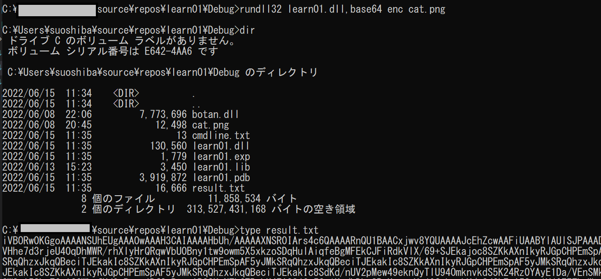
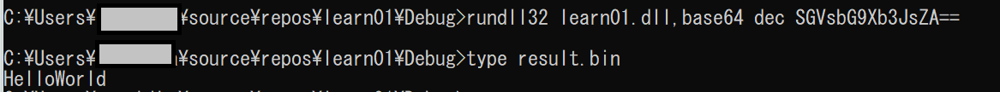

# Base64エンコード/デコードをrundll32経由のDLLに実装

-----
### **この記事の内容**  

先の記事で書いたbase64エンコード・デコードを今度はrundll32を使ったDLL経由で実行させられるように実装しました。  
**注意: 作者はC/C++共に初心者なので入り混じった様なコード書いたりしますし、無意味な実験するかもしれませんがご容赦下さい**

-----

ここでは前回試した、base64の機能についてrundll32を利用した実装を試したいと思います。  

一旦おさらいですが、base64処理は何を使ってどのようなことを実行しているか書きます。  

* 何を使っている？: botanというライブラリを利用
* どういう処理？：dec/encというコマンドラインを渡せば、それにそって事前に定義されたファイル名のファイルをデコードしたりエンコードします。

内容見てあくまでテストなのでこんな感じですが、さすがに柔軟性がなさすぎますし、これを機に処理は以下のように変えたいと思います。  

enc/decに追加でもう１つ渡し、それをベースにエンコード・デコードする。
エンコード・デコードの結果はファイルに記載する。  
* エンコード例) enc cat.png -> result.txtに書き込み  
* デコード例) dec Base64文字列 -> result.binに書き込み  

さて、それでは開発に入ります。  

### rundll32から呼び出す関数を作成  

今回は、base64という関数を作ります。  
```c
extern "C" {
	__declspec(dllexport) void _cdecl base64(HWND hWnd,
						HINSTANCE hInstance, LPSTR lpszCmdLine, int nCmdShow){
                            // ここに処理を記載
                        }
}
```

この中にbase64を処理する内容を記載します。あと、引数の`lpszCmdLine`がワイド文字列でなくても大丈夫ということを知ったため、今回からLPSTRにしてます。  

base64の処理をする内容は`base64operation`という関数に詰め込みましょう。  

```c
std::string base64operation(const char* op, const char* target) {
    if (strcmp(op, "enc") == 0) {
        // エンコード処理
        const char* fname = target;
		FILE * fp = NULL;
		fopen_s(&fp, fname, "rb");
		struct stat sb;
		stat(fname, &sb);
        char *rdata = new char[sb.st_size + 1];
		fread(rdata, sizeof(char), sb.st_size, fp);
		std::string str = Botan::base64_encode(reinterpret_cast<const uint8_t*>(rdata), sb.st_size);
		std::ofstream writing_file;
		std::string filename = "result.txt";
        writing_file.open(filename, std::ios::out);
		writing_file << str << std::endl;
		writing_file.close();
		fclose(fp);
        delete rdata;
        // 結果はresult.txtというファイルに保存
        return std::string("encoding to result.txt");
    } else if (strcmp(op, "dec") == 0) {
        // デコード処理
		char out_fname[] = "result.bin";
		printf("base64 decode and write to %s\n", out_fname);
        const char* b64enc = target;
        FILE* output_file = fopen(out_fname, "wb");
        uint8_t *data = new uint8_t[strlen(b64enc)];
        size_t datasize = Botan::base64_decode(data, b64enc, strlen(b64enc));
        fwrite(data, 1, datasize, output_file);
        fclose(output_file);
        delete data;
        // 結果はresult.binというファイルに保存(データタイプ不明のため)
        return std::string("encoding to result.bin");
    }
    else {
        return std::string("operation cannot support");
    }
}
```

これは前記事の`binaccess`という関数とほぼそのままですが、戻り値がvoidではなく、std::stringになっていたり、ファイル名を絶対パスで指定せず実行パスに保存するようにしていたりなど違いがあります。  

これで、今度は呼び出し側の定義ですね。  

```c
	__declspec(dllexport) void _cdecl base64(HWND hWnd,
						HINSTANCE hInstance, LPSTR lpszCmdLine, int nCmdShow){
        // 引数をstd::stringにする
        std::string str = std::string(lpszCmdLine);
        // 確認のためにcmdline.txtにコマンドライン内容を保存
		std::ofstream writing_file;
		std::string filename = "cmdline.txt";
        writing_file.open(filename, std::ios::out);
		writing_file << str << std::endl;
		writing_file.close();
        // 空白で分割するために位置を確認
        int index = str.find(" ");
        if (index == -1) {
            // 空白がなければNGのメッセージだけ出して終了
			std::string command = "cmd /c echo illegal cmdline && pause";
			system(command.c_str());
        }
        else {
            // 空白でサブストリングを取得(分割処理)
            std::string func = str.substr(0, index);
			std::string target = str.substr(index+1);
            // base64operation関数を実行
            std::string result = base64operation(func.c_str(), target.c_str());
			std::string command = "cmd /c echo ' " + result +" ' && pause";
			system(command.c_str());
        }
	};
```

大した内容ではないですね。基本的にはコマンドラインの取得をして処理させるところが今回の肝です。  
では、これで動作させてみましょう！  

前にも使った、catという画像を使って、エンコードさせてます。


元画像は以下。  


次にデコードです。  
今回は`SGVsbG9Xb3JsZA==`というbase64文字列をデコードします。ちなみにこれは`HelloWorld`です。  



できてますねー！今回はこれで完了です。大体、組み込みのイメージもつかめました。次はプロセス起動やネットワークアクセスなどを試していきましょう。  

**ありがとうございました。**

