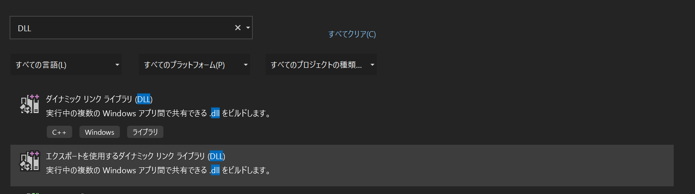

# DLL開発に関するメモ

DLLの開発（そもそもC++での開発）をやったことないので、勉強ついでにメモしていきます。  
ちなみにこれをやり始めた理由としては、最近EmotetもDLLベースですし、その前のIcedID、その他のものもDLLベースが非常に多いと感じているためです。  
大きな目標としてはrundll32やregsvr32ベースで動くアプリケーションを作ることを目標としてます。  
`regsvr32を使いますが、別にCOMコンポーネントの登録をしたいわけではないです。DllMainで動かす形です`

##### 注意  

`勉強しながら順々に書いてるメモです。筆者はそもそもC言語を使ったことがないレベルです。なので間違ったことが書いてあることも多いと思いますが、ご理解ください`

### 開発するものは何か？

どうやらDLLと一言にいっても様々なものがあるようですが、VisualStudioに出てくるエクスポートを利用するDLLで開発を行います。  

  

### 開発開始

まず、プロジェクト作った時点で以下のようなコードが作成された状態になっています。  
DLLはインポートした時点でDllMainが呼ばれるため、これだけ定義されているわけですね。  

```c
#include "pch.h"

BOOL APIENTRY DllMain( HMODULE hModule,
                       DWORD  ul_reason_for_call,
                       LPVOID lpReserved
                     )
{
    switch (ul_reason_for_call)
    {
    case DLL_PROCESS_ATTACH:
    case DLL_THREAD_ATTACH:
    case DLL_THREAD_DETACH:
    case DLL_PROCESS_DETACH:
        break;
    }
    return TRUE;
}
```

まずは、このコード内にある以下を調べてみたいと思います。

- ul_reason_for_call
- DLL_PROCESS_ATTACH
- DLL_THREAD_ATTACH
- DLL_THREAD_DETACH
- DLL_PROCESS_DETACH

`ul_reason_for_call`については、関数のレシーバになってますので、そこを見る形ですね。  
ということで、DllMain関数を見てみたいと思います。  
[参考ページ](https://docs.microsoft.com/ja-jp/windows/win32/dlls/dllmain)

これを見ると想像通りですが、第２引数は`reason for calling function`になってますので、この関数の呼び出し理由のようです。  

ちなみに、DllMainの説明として以下のように書かれています。  

-----

**DllMain**  
ダイナミック リンク ライブラリ (DLL) への省略可能なエントリポイント。   
システムは、プロセスまたはスレッドを開始または終了するときに、プロセスの最初のスレッドを使用して、読み込まれた DLL ごとにエントリ ポイント関数を呼び出します。  
システムは、 **LOADLibrary** 関数と **FreeLibrary** 関数を使用して DLL を読み込みまたはアンロードするときにも、DLL のエントリ ポイント関数を呼び出します。  

-----

この説明を聞くと、対象のDLLにおいてこの関数が呼び出されるタイミングは、呼び出し元にもよりますが、以下のようになっているようです。  

1. 呼び出し元：システム  

`「LoadLivraryでDLLを読み込んだ時」`または`「FreeLibraryでDLLをアンロードした時」`に実行されるようです。  

2. 呼び出し元：プロセス・スレッド  

プロセスまたはスレッドの開始と終了時に、この関数をプロセスの最初のスレッドが呼び出すようです。  
プロセスの最初のスレッドというのはメインスレッド、ということかな？と思います。（間違ってたらごめんなさい）  

こう考えると、caseで分岐していた理由の情報が何となく理解できますね。  

- DLL_PROCESS_ATTACH
- DLL_THREAD_ATTACH
- DLL_THREAD_DETACH
- DLL_PROCESS_DETACH

DLL_PROCESS_ATTACH/DETACH(プロセスへのDLLのアタッチ・ディタッチ)、ほぼ同じようにThreadへのアタッチ・ディタッチとそのまま読み取れます。  
この点は何となくわかりました。じゃあ、例えば`rundll32 xxx.dll,start` みたいに呼び出したらまずは、DLL_PROCESS_ATTACHでキャッチできる、て感じですかね。おそらくは。  

ということで、まずはここでhelloWorldをやっていきたいと思います。  

### HelloWorld!

まず、printfを使おうとしたらエラーになるということを気づきました。


で、よく見たら`stdio.h`をincludeしていない。DLLの基本プロジェクトだと最小限になっているのか、これがないようですね。  
ということで、これのincludeも追加して以下で完了です。(いらないところは省略)

```c
#include <stdio.h>
// 省略
    case DLL_PROCESS_ATTACH:
        printf("hello world");
        break;
    case DLL_THREAD_ATTACH:
```

buildを実行してみて、試しにrundll32.exeで動かしてみます。  


なんも出ないー！！
なかなか道のりは険しそうだ、、と思わされました。  
(この辺り開発に詳しい人当たり前かもしれませんが、初心者の四苦八苦だと思ってご容赦ください)  

とりあえず、思いつくこととして、rundll32にてdllだけ指定しているだけで、その後のエクスポート関数の指定がないことが影響してるかも？と思い、まずはエクスポート関数を追加してみます。  

エクスポート関数を作るうえで調べてみるとどうやらまずは、[呼び出し規約](https://docs.microsoft.com/en-us/cpp/cpp/argument-passing-and-naming-conventions?redirectedfrom=MSDN&view=msvc-170)というものが重要なようです。

正直詳しくないのですが、visualstudioで作成する場合、標準は`__cdecl`でWin32APIを使うアプリなどでは`__stdcall`などが利用されるようです。  
そのため、とりあえずはこの`__stdcall`を使っていきたい、と思います。

関数を指定して呼び出し規約を統一するには以下のように関数名の前に入れればいいようなので、これを使っていきましょう。  
```c
void __stdcall test() {};
```

次に、公開関数は以下のように`__declspec(dllexport)`をつかって指定できるようです。  
また、これに合わせて`extern "C"`というものも使います。これはどうやらC++の特性としてコンパイル時に関数名を自動で置き換える(マングリング)というものがあるため、エクスポート関数の関数名が変わってしまうことを回避するためです。  
これらを考慮し、以下のような関数を追加しました。  
```c
extern "C" {
    __declspec(dllexport) void __stdcall test() {};
}
```

さぁ、実行してみましょう。  


変わらず何も出ない。。なんでやねん。。とぶつくさいいながら調べたらあっさり情報が出てきました。以下のページを参考に再度チャレンジしていきましょう。  

[Qiita:WindowsのGUIアプリやDLL内からのprintfを画面表示する方法](https://qiita.com/comocc/items/4604bea440018dfb5bd1)

参考に以下を試してみましたが。。これもできません。
HelloWorld的なコンソール表示自体がrundll32利用時は中々できないのだろうか。。

```c
void CreateConsole(void) {
    FILE* fp;
    AllocConsole();
    freopen_s(&fp, "CONOUT$", "w", stdout); /* 標準出力(stdout)を新しいコンソールに向ける */
    freopen_s(&fp, "CONOUT$", "w", stderr); /* 標準エラー出力(stderr)を新しいコンソールに向ける */
}

extern "C" {
    __declspec(dllexport) void __stdcall test() {};

	__declspec(dllexport) void __cdecl func1(void) {
		fprintf_s(stdout, "%s\n", __func__); /* 標準出力 */
	}

	__declspec(dllexport) void __cdecl func2(void) {
		fprintf_s(stderr, "%s\n", __func__); /* 標準エラー出力 */
	}
}
// 省略
BOOL APIENTRY DllMain(
// 省略
    case DLL_PROCESS_ATTACH:
        CreateConsole();
        break;
// 省略
```

とりあえず、以下の様にコマンド実行を試してみますと、これはできます。

```c
    case DLL_PROCESS_ATTACH:
        CreateConsole();
		system("cmd /c echo HelloWorld && pause");
        break;
```


仕方がない。これでHelloWorldはできたことにしましょう。まぁコンソール出力がやりたいことでもないですし。。  

ちなみにやっている途中で気づいたのですが、以下エラーが出てました。
`E0144	型 "const char *" の値を使用して型 "char *" のエンティティを初期化することはできません`

これはどうやら以下パスにある「その他のオプション」設定をすることで対応可能なようです。  
`ソリューションエクスプローラ > プロパティ > C/C++ > すべてのオプション`

* 設定項目：その他のオプション
* 設定内容：/Zc:strictStrings-


これで、以下のような定義も可能となりました。  

```c
        char *command = "cmd /c echo HelloWorld && pause";
		system(command);
```

次に。rundll32でDLLを呼び出した際のコマンドラインが受け取れるかを見てみます。  

#### コマンドラインを受け取る  

コマンドラインを受け取るうえで、そもそもrundll32で呼び出す関数は以下のように指定するようです。  

```c
	__declspec(dllexport) void CALLBACK UpdateW(HWND hWnd,
						HINSTANCE hInstance, LPWSTR lpszCmdLine, int nCmdShow){}
```

どうやらこの引数の並び自体は固定のようです。この中の`lpszCmdLine`が引数となります。  
さぁ、見てみましょう。
ただ、型がLPWSTRであり、charに変換するのは一手間必要なようです。とりあえず、以下でファイルに書き込んで試してみましょう。  

```c
__declspec(dllexport) void CALLBACK UpdateW(HWND hWnd,
                    HINSTANCE hInstance, LPWSTR lpszCmdLine, int nCmdShow){
    FILE *fp;
    fopen_s(&fp, "fprintfExample.txt", "w");
    fwrite(lpszCmdLine, sizeof(wchar_t), wcslen(lpszCmdLine), fp);
    fclose(fp);
    char *command = "cmd /c type fprintfExample.txt && pause";
    system(command);
}
```

これはファイルに書き込んだうえで、その内容をtypeで表示させてます。見てみましょう。  


うまくいきましたね。とりあえず引数も受け取れていることが確認できました。  
これで、何とかスタートラインに立てた感じですね。次回はもう少し機能追加をやっていきましょう。(そもそもC言語の勉強をしないといけない気もしますが。。)


